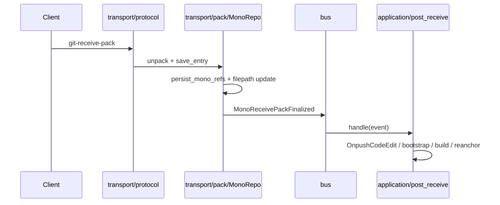

# Ceres

Monorepo domain library for Mega: Git transport, REST application logic, and shared models.

## Design goals

Ceres is the **domain layer** of Mega. `mono` is the composition root (HTTP/SSH servers, routers, auth, OpenAPI); `jupiter` is persistence. Ceres owns everything in between: what Git pushes mean, how CLs merge, how REST APIs behave, and which DTOs cross crate boundaries.

| Goal | What it means in practice |
|------|---------------------------|
| **Transport / application split** | `transport/` handles Git Smart HTTP/SSH and pack I/O only. `application/` owns business reactions (CL edits, merge queue, builds, webhooks). The two layers talk through `bus` events (`MonoReceivePackFinalized`, `ImportReceivePackFinalized`), not direct imports. |
| **Thin `mono` routers** | HTTP handlers in `mono` validate input, call `MonoAppServices`, and map errors to HTTP. Routers must not touch `Storage`, `callisto`, or `jupiter::service` directly. |
| **Domain-scoped facades** | `MonoAppServices` exposes per-domain services (`cl()`, `issue()`, `user()`, `artifact()`, …). `MonoApiService` remains the Git/protocol-oriented core and narrows further over time (`git_ops`, `stack`, merge paths). |
| **DTO hub** | `ceres/model` is the only HTTP/OpenAPI schema surface for mono REST. Map `jupiter::model` / `callisto` entities here; never leak storage types into `mono`. |
| **Typed errors** | Application code returns `MegaError`. Git transport returns `ProtocolError`. HTTP status mapping lives in `common::errors`; `mono` adapts to `ApiError` / `protocol_error`. |
| **Framework isolation** | Ceres application code does not depend on `axum`. Web framework concerns stay in `mono`. (`axum-core` is confined to `infra/pack_decode.rs` for a `git-internal` stream error shim.) |
| **Enforced boundaries** | Dependency rules below are checked in CI (`.github/workflows/base.yml`): no `jupiter::model` in `mono`, no `MonoApiService` in `transport`, no legacy `ceres::api_service` paths in `mono`, no `.storage` / `_stg()` in routers. |
| **Incremental modularization** | Split the historical god-object (`mono_api_service.rs`) into `application/api_service/mono/*` modules without breaking callers. Prefer new logic in domain modules + `*ApplicationService` types over growing `MonoApiService` blindly. |
| **Substitutable ports** | Cross-cutting integration uses explicit ports (`GitOpsPort`, `BuildDispatchPort`, `changes_port`) so transport and triggers can be tested or swapped without reaching into storage details. |

**Non-goals:** Ceres does not run servers, own database migrations (`jupiter-migrate`), or define the mono ↔ Orion wire protocol (`api-model`). It does not embed frontend or deployment config.

## Module layout

```
ceres/src/
├── lib.rs
├── bus/                    # Transport ↔ application event bus
├── infra/                  # TransportContext, GitObjectCache, pack streams, decode errors
├── transport/
│   ├── protocol/           # Smart HTTP/SSH Git protocol
│   └── pack/               # receive-pack / upload-pack handlers
├── application/
│   ├── api_service/        # MonoApiService, MonoAppServices, domain *ApplicationService
│   ├── code_edit/          # CL create/update pipelines + post-receive handlers
│   ├── build_trigger/      # Orion build dispatch
│   ├── artifact/           # Artifact upload orchestration
│   ├── notification/       # Email dispatch + notification triggers
│   └── webhook/            # Webhook admin + delivery
├── model/                  # HTTP/API DTOs (utoipa schemas)
├── diff/, merge_checker/, lfs/
```

`mono` uses `ceres::application::*` and `ceres::transport::*` for domain logic and Git transport.

`axum-core` is confined to `ceres/infra/pack_decode.rs` for `git-internal` pack decode stream errors until upstream accepts `std::io::Error`.

## Dependency rules

| Module | May depend on | Must not depend on |
|--------|---------------|-------------------|
| `transport` | `bus`, `infra`, `model`, `jupiter`, `git-internal` | `application::*` |
| `application` | `bus`, `infra`, `model`, `jupiter`, `git-internal` | `transport::*` (except bus event DTOs) |
| `bus` | Minimal shared types for events | `transport` / `application` implementations |
| `mono` (binary) | Assembles `TransportRuntime` + injects handlers | — |

## Model boundary

Three DTO layers; keep imports aligned with this table:

| Layer | Crate / path | Role | Consumers |
|-------|--------------|------|-----------|
| Wire | `api-model` | mono ↔ orion cross-process protocol (buck2, artifacts, shared pagination wrappers) | `mono`, `orion`, `orion-client`, `ceres` (pagination only where needed) |
| HTTP / OpenAPI | `ceres/model` | All mono REST request/response types + `utoipa` schemas | `mono` routers, `ceres` application |
| Storage assembly | `jupiter/model` | Bundles of `callisto` entities from storage/services; no serde/utoipa | `jupiter` storage/service, `ceres` application only |

Rules:

- `mono` routers must **not** `use jupiter::model` — map via `ceres::model` and `MonoAppServices` facades.
- `mono/src` must **not** `use callisto::` or `jupiter::service::` — storage entities and service calls stay in `ceres` application layer.
- `ceres/src/transport` must **not** reference `MonoApiService` (transport ↔ application boundary).
- `api-model` is **not** mono HTTP schema (except shared wrappers like `CommonPage` / `Pagination`).
- `ceres/model` is the mapping hub: `impl From<jupiter::model::*>` and `impl From<callisto::*>` live here.
- `application/build_trigger/model` is a ceres subdomain API schema (build triggers); same HTTP rules as `ceres/model`, kept alongside orchestration until a later consolidation.

## Error type boundaries

| Layer | Error type | HTTP adapter (mono) |
|-------|------------|---------------------|
| `ceres/application`, `jupiter` | `MegaError` | `ApiError` (`mono/src/api/error.rs`) |
| `ceres/transport`, Git Smart HTTP/SSH | `ProtocolError` | `protocol_error::into_response` |
| Buck upload | `BuckError` (via `MegaError::Buck`) | `ApiError` |
| Git LFS | `GitLFSError` | `map_lfs_error` in `lfs_router` |

Rules:

- REST routers and application services use `MegaError` only; `api_handler` resolves import vs mono handlers and returns `MegaError`.
- `ProtocolError` is confined to Git client protocol paths; use `mega_to_protocol_error` at transport boundaries when mapping domain failures.
- Do not use `ProtocolError` in REST handlers.
- Prefer typed `MegaError` variants (`BadRequest`, `NotFound`, `Conflict`, …) over `[code:xxx]` string encoding in new code.

Long term: extract `ceres/model` → `mega-api-types` only if a non-mono consumer needs HTTP DTOs without ceres domain code.

## Git push event flow



Import-repo pushes follow the same pattern via `ImportReceivePackFinalized` → `application/code_edit/post_receive/import.rs`.

## Assembly (`mono`)

`mono` constructs `MonoAppServices` (which owns `TransportRuntime`, domain `*ApplicationService`s, and `MonoApiService`), then passes it to REST and Git protocol handlers via `MonoApiServiceState`.

```rust
let services = MonoAppServices::new(storage, git_object_cache, build_dispatch);
// services.transport_runtime() — Git pack handlers + application event bus
// services.cl() / services.issue() / … — REST domain facades
// services.git() — Git/protocol-oriented MonoApiService (GitApplicationService alias)
// services.changes_port() — ChangesPort for build trigger (Arc<dyn ChangesPort>)
```

`build_mono_stack()` in `stack.rs` is the sole construction path for the shared `git` + `cl` pair.
