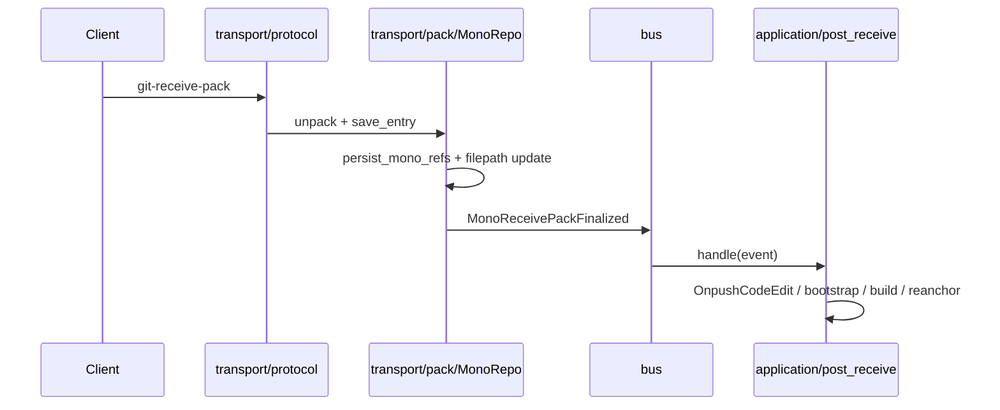

# Ceres

Monorepo domain library for Mega: Git transport, REST application logic, and shared models.

## Module layout

```
ceres/src/
├── lib.rs
├── bus/                    # Transport ↔ application event bus
├── infra/                  # Shared infrastructure (GitObjectCache, pack streams, decode errors)
├── transport/
│   ├── protocol/           # Smart HTTP/SSH Git protocol
│   └── pack/               # receive-pack / upload-pack handlers
├── application/
│   ├── api_service/        # MonoApiService, REST-facing ops
│   ├── code_edit/          # CL create/update pipelines + post-receive handlers
│   └── build_trigger/      # Orion build dispatch
├── model/                  # HTTP/API DTOs
├── diff/, merge_checker/, lfs/
```

`mono` uses `ceres::application::*` and `ceres::transport::*` for domain logic and Git transport.

`axum-core` is confined to `ceres/infra/pack_decode.rs` for `git-internal` pack decode stream errors until upstream accepts `std::io::Error`.

## Dependency rules

| Module | May depend on | Must not depend on |
|--------|---------------|-------------------|
| `transport` | `bus`, `infra`, `model`, `jupiter`, `git-internal` | `application::*` |
| `application` | `bus`, `infra`, `model`, `jupiter`, `git-internal` | `transport::*` (except bus event DTOs) |
| `bus` | Minimal shared types for events | `transport` / `application` implementations |
| `mono` (binary) | Assembles `TransportRuntime` + injects handlers | — |

## Model boundary

Three DTO layers; keep imports aligned with this table:

| Layer | Crate / path | Role | Consumers |
|-------|--------------|------|-----------|
| Wire | `api-model` | mono ↔ orion cross-process protocol (buck2, artifacts, shared pagination wrappers) | `mono`, `orion`, `orion-client`, `ceres` (pagination only where needed) |
| HTTP / OpenAPI | `ceres/model` | All mono REST request/response types + `utoipa` schemas | `mono` routers, `ceres` application |
| Storage assembly | `jupiter/model` | Bundles of `callisto` entities from storage/services; no serde/utoipa | `jupiter` storage/service, `ceres` application only |

Rules:

- `mono` routers must **not** `use jupiter::model` — map via `ceres::model` and `MonoApiService` facades.
- `mono/src` must **not** `use callisto::` or `jupiter::service::` — storage entities and service calls stay in `ceres` application layer.
- `ceres/src/transport` must **not** reference `MonoApiService` (transport ↔ application boundary).
- `api-model` is **not** mono HTTP schema (except shared wrappers like `CommonPage` / `Pagination`).
- `ceres/model` is the mapping hub: `impl From<jupiter::model::*>` and `impl From<callisto::*>` live here.
- `application/build_trigger/model` is a ceres subdomain API schema (build triggers); same HTTP rules as `ceres/model`, kept alongside orchestration until a later consolidation.

## Error type boundaries

| Layer | Error type | HTTP adapter (mono) |
|-------|------------|---------------------|
| `ceres/application`, `jupiter` | `MegaError` | `ApiError` (`mono/src/api/error.rs`) |
| `ceres/transport`, Git Smart HTTP/SSH | `ProtocolError` | `protocol_error::into_response` |
| Buck upload | `BuckError` (via `MegaError::Buck`) | `ApiError` |
| Git LFS | `GitLFSError` | `map_lfs_error` in `lfs_router` |

Rules:

- REST routers and `MonoApiService` use `MegaError` only; `api_handler` resolves import vs mono handlers and returns `MegaError`.
- `ProtocolError` is confined to Git client protocol paths; use `mega_to_protocol_error` at transport boundaries when mapping domain failures.
- Do not use `ProtocolError` in REST handlers.

Long term: extract `ceres/model` → `mega-api-types` only if a non-mono consumer needs HTTP DTOs without ceres domain code.

## Git push event flow



Import-repo pushes follow the same pattern via `ImportReceivePackFinalized` → `application/code_edit/post_receive/import.rs`.

## Assembly (`mono`)

`mono` constructs a `TransportRuntime` (alias: `ProtocolApiState`) with storage, `GitObjectCache`, and `RuntimeApplicationHandler`, then passes it to HTTP/SSH Git routers and REST handlers.

```rust
let runtime = TransportRuntime::new(storage, git_object_cache);
// runtime.application handles MonoReceivePackFinalized / ImportReceivePackFinalized
```
