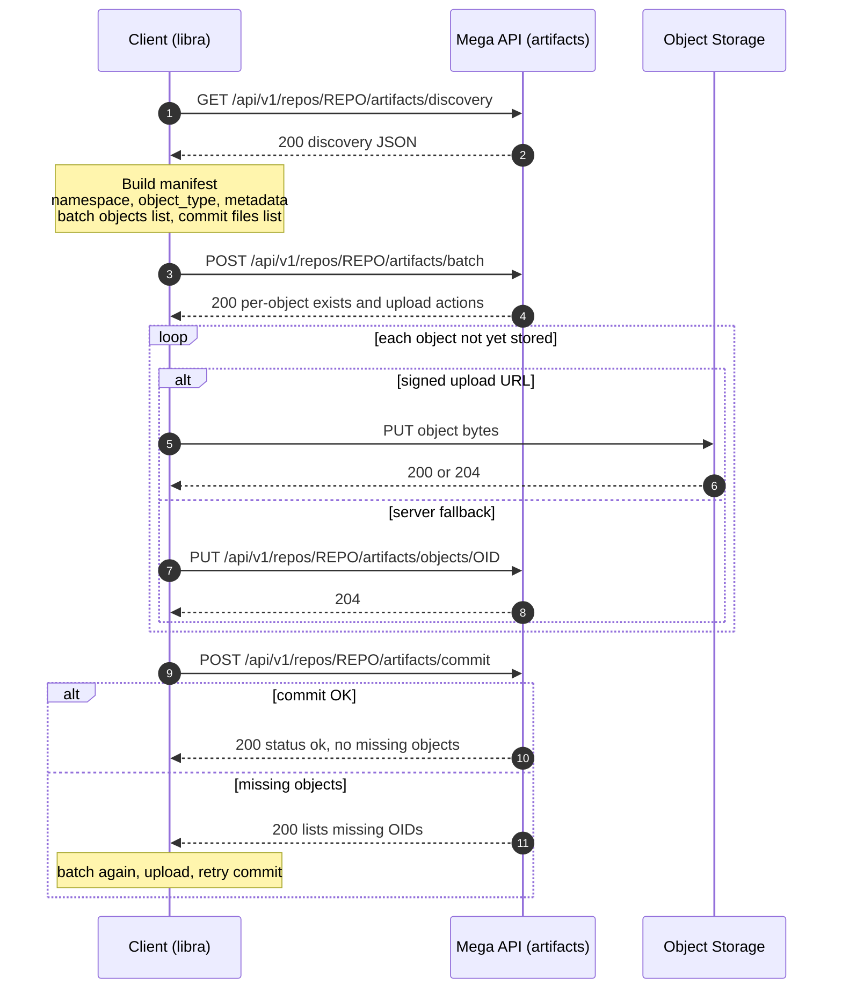
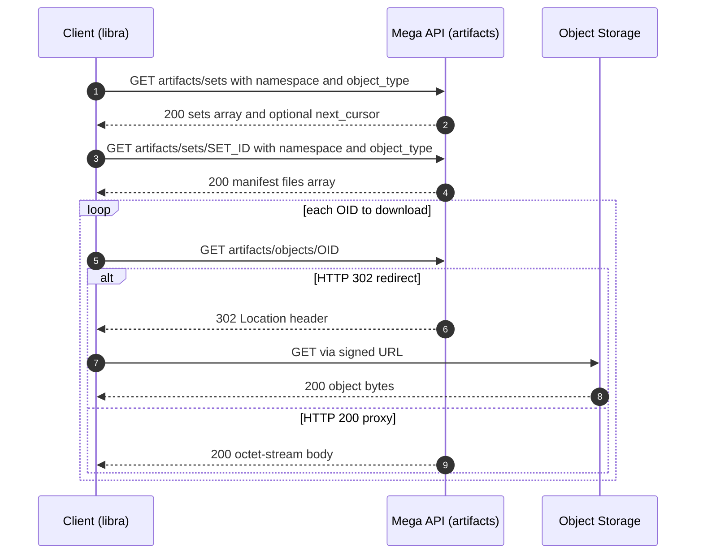

# Repo-Scoped Artifact Upload Protocol (v1)

This document specifies an **extended upload protocol** for repo-scoped files that are related to a repository but **must not** be part of the Git object graph and **do not need to be cloneable**.

It is designed for independent clients (e.g. `libra`) to upload and index repo-related artifacts such as build outputs, caches, reports, analyses, or any other auxiliary files.

In this project, the primary artifact types are **AI-related object files** like `decision`, `evidence`, `intent`, etc (see the reference layout in [`git-internal/src/internal/object`](https://github.com/web3infra-foundation/git-internal/tree/main/src/internal/object)). These objects are **repo-scoped**, but they are **not** part of the Git object graph and **do not** need to be cloneable.

## 1. Contents

- **2.** Goals
- **3.** Non-goals
- **4.** Design rationale (not LFS; not Smart Protocol extension)
- **5.** Object types (`git-internal` 0.7.4)
- **6.** Concepts
- **7.** Authentication
- **8.** HTTP API (`/api/v1`: discovery, errors, write and read operations)
- **9.** Client flow (`libra`, diagrams, implementation steps)
- **10.** Backend storage (tables, GC, path conventions)
- **11.** Design notes

## 2. Goals

- Provide a **repo-scoped** upload API for file sets.
- Support **batch negotiation**, **direct-to-object-storage uploads** (signed URLs), **deduplication by reusing the same UUID `oid`**, and **idempotency**.
- Make uploaded artifacts **queryable** via an index/manifest.
- Keep the protocol separate from Git Smart Protocol and Git LFS semantics to avoid confusion.

## 3. Non-goals

- Not a replacement for Git Smart Protocol (`git-receive-pack` / `git-upload-pack`).
- Not a Git LFS server compatibility layer.
- Not intended to create or modify a cloneable Git repository state.

## 4. Design rationale: not LFS, not Smart Protocol extension

### 4.1 Why this API is not Git LFS–compatible

- **Different product semantics**: Git LFS is tied to **cloneable Git repositories**: pointer files live in Git history, and `git lfs` uses the LFS batch API plus standard Git transport. This artifact protocol targets **repo-related blobs that are not part of the Git object graph** and need not be fetchable via `git clone` / `git-lfs`.
- **Different identity model**: LFS object ids are typically **content hashes** (e.g. SHA-256 of the blob) and the wire format is `application/vnd.git-lfs+json`. Here, **`oid` is a UUID** (see Concepts), deliberately **not** the same as Git’s object id or LFS’s content-addressed oid, to avoid conflating AI artifact storage with Git/LFS object identity.
- **Ecosystem cost**: Pretending to be LFS would mislead standard Git/LFS clients and tools; maintaining a “looks like LFS but isn’t” surface creates security, caching, and support burden.

### 4.2 Why we do not extend Git Smart Protocol capabilities

- **Wrong layer**: Smart protocol capabilities (`side-band-64k`, `report-status`, etc.) negotiate **fetch/push of Git packfiles and refs**. Artifact upload is an **orthogonal HTTP concern** (batch URLs, object storage, manifests). Stuffing “upload AI files” into capability strings couples unrelated lifecycles and confuses every standard Git client.
- **Compatibility**: Unknown capabilities are ignored or rejected by many Git implementations; a custom capability would not reliably **notify** a bespoke client like `libra` without also teaching all Git binaries about it—which is not the goal.
- **Operational clarity**: Discovery + REST/JSON endpoints give explicit **versioning** (`protocol_version`), limits, and error semantics without overloading pkt-line transport.

## 5. Object types source of truth (local `git-internal` 0.7.4)

The object type names used in this protocol are aligned to the **local** `git-internal` crate version pinned by this repository (`git-internal = "0.7.4"`). The canonical list lives in:

- `git-internal-0.7.4/src/internal/object/mod.rs` (module list)
- `git-internal-0.7.4/src/internal/object/types.rs` (`ObjectType` string labels)

For reference, the upstream directory layout is also visible at [`git-internal/src/internal/object`](https://github.com/web3infra-foundation/git-internal/tree/main/src/internal/object).

**AI object types (0.7.4)** (strictly the canonical `ObjectType` string labels from `types.rs`):

- `snapshot`
- `decision`
- `evidence`
- `patchset`
- `plan`
- `provenance`
- `run`
- `task`
- `intent`
- `invocation`
- `context_frame`
- `intent_event`
- `task_event`
- `run_event`
- `plan_step_event`
- `run_usage`

Notes:

- Git-native object types (`blob`, `tree`, `commit`, `tag`) exist in `git-internal` but are **not** the focus of this artifact protocol.
- Some `src/internal/object/*.rs` modules are helpers or non-`ObjectType` payloads; this document only treats `ObjectType` labels above as supported artifact types.

## 6. Concepts

- **Object (blob)**: Binary bytes stored in object storage, addressed by **`oid`**. The **`oid` is a UUID string** (RFC 4122, e.g. UUIDv4 or UUIDv7), **not** a Git object hash and **not** Git’s SHA-256 object id. Clients allocate (or receive) a UUID per blob before upload; the server uses that UUID as the storage key / primary key in the artifact object table.
- **Artifact set**: A committed manifest for a batch of file mappings in a given namespace.
- **Namespace**: A logical partition to separate concerns within the same repo (producer, environment, retention rules, etc). Example: `libra`, `ci`, `analysis`.
- **Object type**: The semantic type label aligned with `git-internal` `ObjectType` (0.7.4), e.g. `decision`, `evidence`, `intent_event`, etc. The canonical set is listed above.
- **Manifest / index**: A mapping from logical `path` to `{oid, size, content_type, metadata}` stored in DB.

## 7. Authentication

- HTTP: `Authorization: Bearer <token>`.
- Users generate the token in the **Mega** web UI and paste or configure it in clients (e.g. `libra`). Treat it as a secret; rotate or revoke it from the UI when needed.
- This protocol specifies **user authentication** only; it does not define OAuth scopes, roles, or fine-grained API permissions.

## 8. HTTP API (`/api/v1`, OpenAPI under `Repo Artifacts`)

Base (recommended): `/api/v1`

### 8.1 Path segment `{repo}`

In `/api/v1/repos/{repo}/artifacts/...`, **`{repo}` is exactly one URL path segment** (the text between two `/` characters). It identifies which repository the artifacts belong to.

**What to send (deployment-defined, but constrained by URL syntax)**

- **Single-segment identifier (typical):** a slug or id with **no raw `/`**, e.g. `mega`, `42`, `acme-hello`.
- **Names that contain `/` (e.g. `group/project`):** encode **`/` as `%2F`** inside that single segment, e.g. `acme%2Fhello-world` → path `/api/v1/repos/acme%2Fhello-world/artifacts/...`. Servers MUST document whether they use this form, a flat slug, a numeric id, or a filesystem path token.
- **Not valid in v1 path shape:** multiple extra path segments such as `/api/v1/repos/acme/hello/artifacts/...` unless the implementation explicitly defines that routing (this protocol’s OpenAPI uses one `{repo}` segment only).

Implementations SHOULD accept the same `repo` value they use elsewhere to select a repo (e.g. the same string stored in `artifact_sets.repo` or returned by repo listing APIs).

### 8.2 Discovery / capabilities (recommended)

This endpoint allows clients to discover server capabilities **without** extending Git Smart Protocol capabilities.

- **GET** `/api/v1/repos/{repo}/artifacts/discovery`
- **Purpose**
  - Discover supported `object_type` labels and transfer modes.
  - Learn server-side limits (max objects per batch, upload size limits, default concurrency hints).
  - Provide a stable versioned contract for clients (`protocol_version`).
- **Caching**
  - Clients MAY cache this response (e.g. 5–30 minutes) and refresh on errors or configuration changes.
- **Authentication**
  - If the server requires a logged-in user, unauthenticated calls SHOULD receive `401`. Clients SHOULD call discovery with the **same Bearer token** (from the Mega UI) they will use for upload/commit.

Response example:

```json
{
  "protocol_version": "artifacts/v1",
  "supported_object_types": [
    "snapshot",
    "decision",
    "evidence",
    "patchset",
    "plan",
    "provenance",
    "run",
    "task",
    "intent",
    "invocation",
    "context_frame",
    "intent_event",
    "task_event",
    "run_event",
    "plan_step_event",
    "run_usage"
  ],
  "transfers": {
    "signed_url_put": true,
    "server_fallback_put": true,
    "signed_url_get": true,
    "server_proxy_get": true
  },
  "limits": {
    "max_objects_per_batch": 1000,
    "max_object_size_bytes": 10737418240,
    "max_commit_files": 50000
  },
  "hints": {
    "default_max_concurrency": 8,
    "multipart_threshold": 104857600
  }
}
```

**Implementation note (Mega):** `transfers.signed_url_put` and `transfers.signed_url_get` are **`true` only when the deployment uses S3 or GCS** (presigned URLs). With **local** object storage they are **`false`**; clients then use `server_fallback_put` and `server_proxy_get` only. Always trust the live discovery JSON over static examples.

### 8.3 Error codes & retry semantics (client guidance)

This section defines recommended HTTP status meanings and how clients (e.g. `libra`) SHOULD react. It applies to `discovery`, read APIs (`sets`, `resolve-file`, `objects` GET), `batch`, object uploads, and `commit` unless stated otherwise.

#### 8.3.1 General rules

- **Idempotency**
  - `GET /discovery` is safe to retry.
  - `POST /batch` is safe to retry.
  - Object uploads (signed URL or fallback) SHOULD be idempotent by `oid`.
  - `POST /commit` SHOULD be idempotent by `(repo, namespace, object_type, artifact_set_id)`.
- **Retry policy**
  - Retry **transient** failures with exponential backoff + jitter.
  - Do **not** blindly retry most 4xx; fix the request, **re-issue the Mega UI Bearer token** if needed, or refresh signed-URL credentials per object-store behavior.

#### 8.3.2 Common status codes

| HTTP status | Meaning | Client action |
|---:|---|---|
| 200/201/204 | Success | Continue |
| 400 Bad Request | Invalid JSON, invalid UUID `oid`, invalid `path`, invalid `object_type`, size mismatch, etc | Do not retry; fix request/data |
| 401 Unauthorized | Missing/expired token | Re-issue the token in Mega UI, then retry |
| 403 Forbidden | Server rejected the request (e.g. invalid or revoked token); convention varies by deployment | Re-issue the token in Mega UI if applicable; do not blindly retry |
| 404 Not Found | Repo not found, endpoint not enabled, or object missing on download | Do not retry unless repo/key changes |
| 409 Conflict | Idempotency conflict (same `artifact_set_id` with different content) | Do not retry; generate a new `artifact_set_id` or reconcile |
| 413 Payload Too Large | Object size exceeds server/object-store limit | Do not retry; split or reject file |
| 416 Range Not Satisfiable | Invalid or unsatisfiable `Range` header | Fix or omit `Range`, then retry |
| 304 Not Modified | Full-object GET with matching `If-None-Match` / `ETag` | Use cached body |
| 415 Unsupported Media Type | Wrong `Content-Type` | Fix headers, then retry |
| 429 Too Many Requests | Rate limited | Retry after delay; respect `Retry-After` if provided |
| 5xx | Server error | Retry with backoff; if persistent, surface error |

#### 8.3.3 Endpoint-specific notes

- **`GET /artifacts/discovery`**
  - 5xx / network errors: retry with backoff.
  - 401/403: update the Bearer token (Mega UI) or session, then retry.

- **`POST /artifacts/batch`**
  - 5xx / network errors: retry with backoff.
  - If later uploads fail due to signed URL expiration, the client SHOULD call `/batch` again for the affected `oid`s to obtain refreshed `actions.upload`.

- **Upload to signed URL (`actions.upload.href`)**
  - Signed URLs are expected to fail with object-store specific 4xx errors when expired (often **403**).

| Failure class | Typical signal | Client action |
|---|---|---|
| Signed URL expired / signature invalid | 403 / signature mismatch / expired | Re-run `/batch` for those `oid`s to refresh URL, then retry upload |
| Object store rate limit | 429 / SlowDown | Retry with backoff; reduce concurrency |
| Connectivity issues | timeout / 5xx | Retry with backoff |

- **Fallback upload `PUT /artifacts/objects/{oid}`**
  - 413: object too large for server fallback; client SHOULD use signed URLs (or chunking if introduced).
  - 5xx: retry with backoff.

- **`POST /artifacts/commit`**
  - 409: idempotency conflict; do not retry with the same `artifact_set_id`.
  - If the server reports `missing_objects`, client SHOULD:
    - re-run `/batch` for missing `oid`s,
    - upload missing objects,
    - retry `/commit`.

- **Read APIs (`GET .../artifacts/sets`, `GET .../resolve-file`, `GET .../objects/{oid}`)**
  - Safe to retry for idempotent reads (`GET`); use `ETag` / `If-None-Match` when offered to avoid redundant downloads (may yield **304 Not Modified**).
  - **403**: server rejected the request after authentication; replace the Bearer token (e.g. from Mega UI) if applicable.
  - **404**: unknown repo, unknown set, no matching path/metadata, or object missing; fix identifiers before retry.
  - Signed GET URL expired: re-request the same GET on the Mono API to obtain a fresh **302** or new URL (behavior depends on implementation).

### 8.4 Batch negotiation (upload)

Clients MUST call this endpoint before uploading content.

- **POST** `/api/v1/repos/{repo}/artifacts/batch`
- **Purpose**
  - Determine which objects are already present (dedup).
  - Return upload actions (prefer signed PUT URLs to object storage).
- **Idempotency**
  - Safe to retry: batch MUST NOT require unique client state.

**Field `intent` (top-level, not `object_type`)**

- **`intent`** tells the server **what this batch call is for**. In **v1** the only defined value is **`upload`**: the client is negotiating **writes**—for each listed object, the server reports whether the blob already exists and may return **`actions.upload`** (signed URL or similar).
- This is **orthogonal** to **`object_type`**, which names the semantic kind of artifact (`decision`, `evidence`, `intent`, `intent_event`, …). A batch for AI type **`intent`** still uses `"intent": "upload"` at the top level to mean “upload negotiation”; the type of files is carried in **`object_type`**.
- **Reserved / future:** other `intent` values (e.g. a dedicated read-batch mode) are **not specified in v1**. Servers SHOULD reject unknown values with **400**; clients MUST send **`upload`** for the write path described in this document.

Request example:

```json
{
  "namespace": "libra",
  "object_type": "decision",
  "intent": "upload",
  "objects": [
    { "path": "ai/decision/run-123/decision.json", "oid": "550e8400-e29b-41d4-a716-446655440000", "size": 12345, "content_type": "application/json" },
    { "path": "ai/evidence/run-123/evidence.jsonl", "oid": "6ba7b810-9dad-11d1-80b4-00c04fd430c8", "size": 987654321, "content_type": "application/jsonl" }
  ],
  "metadata": { "commit_sha": "40hex...", "branch": "main", "run_id": "run-123" }
}
```

Response example:

```json
{
  "transfer": "basic",
  "objects": [
    { "oid": "550e8400-e29b-41d4-a716-446655440000", "size": 12345, "exists": true },
    {
      "oid": "6ba7b810-9dad-11d1-80b4-00c04fd430c8",
      "size": 987654321,
      "exists": false,
      "actions": {
        "upload": {
          "href": "https://object-store/...signed...",
          "header": { "Content-Type": "application/octet-stream" },
          "expires_at": "2026-04-09T12:34:56Z"
        }
      }
    }
  ],
  "hints": { "max_concurrency": 8, "multipart_threshold": 104857600 }
}
```

**`objects[].actions` (v1)**

`actions` is an **object** whose **keys are action names**. In protocol **v1** the only normative action for an upload batch is:

| Key | When present | Value shape | Client use |
|---|---|---|---|
| `upload` | `exists=false` and the server offers a direct/signed upload | **Link object**: `href` (required), `header` (optional map), `expires_at` (optional RFC 3339 string) | `PUT`/`POST` bytes to `href` with optional headers; on expiry, re-`batch` |

**Omission rules (v1)**

- If `exists=true`, the server SHOULD **omit** `actions` (or return an empty object). Clients MUST NOT upload.
- If `exists=false` and **no** `actions.upload` is returned, the client MUST use the **fallback** `PUT /api/v1/repos/{repo}/artifacts/objects/{oid}` (or fail if the server disables fallback and returns an error instead).

**Reserved / future**

- Additional keys (e.g. `download`, `verify`, multipart hints) are **not defined in v1**. Clients MUST ignore unknown keys they do not implement.

Notes:

- **`exists` (normative):** `true` only when the server has a row for the `oid` whose stored size matches the requested **`size`** **and** the blob bytes are present in object storage (the same condition `/commit` uses before accepting the object). If metadata exists but the blob is missing, the server MUST return `exists=false` so the client can re-upload.
- Implementations SHOULD refresh `artifact_objects.last_seen_at` when returning `exists=true` for an object, and on successful `/commit` for every `oid` in the manifest (including idempotent replays).
- If `exists=true`, the client MUST skip uploading that object.
- If `exists=false`, the client MUST upload to `actions.upload.href` **when provided**, otherwise use the server fallback object endpoint.

### 8.5 Upload object bytes (server fallback)

If signed URLs are not available, the server MAY accept object bytes directly.

- **PUT** `/api/v1/repos/{repo}/artifacts/objects/{oid}`
- **Content-Type**: `application/octet-stream`
- **Behavior**
  - Uploads are idempotent by `oid`.
  - Server SHOULD validate `Content-Length` where possible.

### 8.6 Commit artifact set (manifest)

After all required objects are uploaded, the client commits a manifest to make it discoverable.

- **POST** `/api/v1/repos/{repo}/artifacts/commit`
- **Idempotency**
  - Use `artifact_set_id` as an idempotency key.
  - If the same `artifact_set_id` is committed with different content, server SHOULD return `409 Conflict`.

Request example:

```json
{
  "namespace": "libra",
  "object_type": "decision",
  "artifact_set_id": "optional-client-uuid",
  "files": [
    { "path": "ai/decision/run-123/decision.json", "oid": "550e8400-e29b-41d4-a716-446655440000", "size": 12345 },
    { "path": "ai/evidence/run-123/evidence.jsonl", "oid": "6ba7b810-9dad-11d1-80b4-00c04fd430c8", "size": 987654321 }
  ],
  "metadata": { "commit_sha": "40hex...", "run_id": "run-123" },
  "expires_in_seconds": 604800
}
```

Response example:

```json
{
  "artifact_set_id": "server-generated-or-confirmed",
  "status": "ok",
  "missing_objects": []
}
```

Server-side checks (recommended):

- Verify all referenced `oid`s exist in object storage (e.g. `HEAD` / `exists` on the backing store key), not only in the metadata table.
- Verify `size` matches stored metadata (if known).

### 8.7 Query and download (read APIs)

Read endpoints use the **same user authentication** as write endpoints. Deployments that allow unauthenticated access SHOULD say so in their own documentation.

**Uniqueness reminder:** an artifact set is keyed by `(repo, namespace, object_type, artifact_set_id)`. Any `GET` for a single set MUST include **`namespace`** and **`object_type`** (as query parameters) together with `artifact_set_id`, unless the server chooses a different path layout that embeds them.

#### 8.7.1 List artifact sets (history / browse)

- **GET** `/api/v1/repos/{repo}/artifacts/sets`
- **Purpose:** Page through committed sets for a repo, filtered by namespace and type—matches the DB index `(repo, namespace, object_type, created_at desc)`.

**Query parameters**

| Name | Required | Description |
|---|---|---|
| `namespace` | yes | Logical partition (same as commit). |
| `object_type` | yes | Canonical `ObjectType` label. |
| `limit` | no | Page size (server MAY cap; default e.g. 50, max e.g. 200). |
| `cursor` | no | Continuation token: use **only** the value last returned as `next_cursor` (wire format below). |
| `run_id` | no | If present, filter `metadata.run_id` (exact match). |
| `commit_sha` | no | If present, filter `metadata.commit_sha` (exact match). |

**Response 200** (`application/json`)

```json
{
  "sets": [
    {
      "artifact_set_id": "f47ac10b-58cc-4372-a567-0e02b2c3d479",
      "namespace": "libra",
      "object_type": "decision",
      "metadata": { "commit_sha": "40hex...", "run_id": "run-123" },
      "created_at": "2026-04-10T10:00:00Z",
      "expires_at": null,
      "file_count": 12
    }
  ],
  "next_cursor": null
}
```

- `file_count` is optional but useful for UI; servers MAY omit it on list for cost reasons.
- When more pages exist, `next_cursor` is non-null; clients pass it as `cursor` on the next request.

**Pagination cursor (format and usage)**

- **Wire format (v1):** `asets-v1|<created_at_unix_micros_utc>|<artifact_sets.id>` (ASCII pipe `|` U+007C between fields). This is a **keyset** cursor aligned with list ordering **`created_at` DESC, `id` DESC** (see §10.2).
- **Client rule:** Treat the string as **opaque**—do not construct or edit it. Copy `next_cursor` into the `cursor` query parameter on the following request, keeping the same `namespace`, `object_type`, and any `run_id` / `commit_sha` filters as the call that produced that cursor.
- **URL encoding:** In query strings, encode `|` as `%7C` if your HTTP stack does not encode automatically.

**Example — first page (no `cursor`)**

```http
GET /api/v1/repos/acme%2Fdemo/artifacts/sets?namespace=libra&object_type=decision&limit=2 HTTP/1.1
Host: mega.example
```

**Example — response with a next page**

```json
{
  "sets": [
    {
      "artifact_set_id": "f47ac10b-58cc-4372-a567-0e02b2c3d479",
      "namespace": "libra",
      "object_type": "decision",
      "metadata": null,
      "created_at": "2026-04-10T12:00:00.000Z",
      "expires_at": null,
      "file_count": 3
    },
    {
      "artifact_set_id": "aaaaaaaa-bbbb-cccc-dddd-eeeeeeeeeeee",
      "namespace": "libra",
      "object_type": "decision",
      "metadata": null,
      "created_at": "2026-04-10T11:00:00.000Z",
      "expires_at": null,
      "file_count": 5
    }
  ],
  "next_cursor": "asets-v1|1712732400000000|9001"
}
```

The `next_cursor` value is illustrative: `1712732400000000` is Unix time in **microseconds** (UTC) for the last row’s `created_at`, and `9001` is that row’s internal **`artifact_sets.id`**.

**Example — second page (same filters, append `cursor`)**

```http
GET /api/v1/repos/acme%2Fdemo/artifacts/sets?namespace=libra&object_type=decision&limit=2&cursor=asets-v1%7C1712732400000000%7C9001 HTTP/1.1
Host: mega.example
```

With **curl**, prefer `--data-urlencode` so `|` is encoded for you:

```bash
curl -G "https://mega.example/api/v1/repos/acme/demo/artifacts/sets" \
  --data-urlencode "namespace=libra" \
  --data-urlencode "object_type=decision" \
  --data-urlencode "limit=2" \
  --data-urlencode "cursor=asets-v1|1712732400000000|9001"
```

When the final page has no further rows, the server returns `"next_cursor": null` and the client stops.

#### 8.7.2 Get one artifact set (manifest + files)

- **GET** `/api/v1/repos/{repo}/artifacts/sets/{artifact_set_id}`
- **Query:** `namespace`, `object_type` (both required).
- **Purpose:** Return metadata for one commit plus the full manifest (each entry includes `path` and `oid`, etc.).

**Response 200**

```json
{
  "artifact_set_id": "f47ac10b-58cc-4372-a567-0e02b2c3d479",
  "namespace": "libra",
  "object_type": "decision",
  "metadata": { "commit_sha": "40hex...", "run_id": "run-123" },
  "created_at": "2026-04-10T10:00:00Z",
  "expires_at": null,
  "files": [
    {
      "path": "ai/decision/run-123/decision.json",
      "oid": "550e8400-e29b-41d4-a716-446655440000",
      "size": 12345,
      "content_type": "application/json"
    }
  ]
}
```

- `content_type` per file MAY be omitted if unknown.
- **404** if the tuple `(repo, namespace, object_type, artifact_set_id)` does not exist.

#### 8.7.3 Resolve logical path (latest matching set)

- **GET** `/api/v1/repos/{repo}/artifacts/resolve-file`
- **Purpose:** Find the **latest** committed file row matching `namespace`, `object_type`, and exact `path`, optionally narrowed by metadata—without knowing `artifact_set_id` upfront.

**Query parameters**

| Name | Required | Description |
|---|---|---|
| `namespace` | yes |  |
| `object_type` | yes |  |
| `path` | yes | Logical path (same encoding rules as commit). |
| `run_id` | no | Match `metadata.run_id` when present on the set. |
| `commit_sha` | no | Match `metadata.commit_sha` when present. |

**Resolution rule (recommended):** among sets that match filters, choose the one with greatest `created_at` (tie-break by internal id). If none match, **404**.

**Response 200**

```json
{
  "artifact_set_id": "f47ac10b-58cc-4372-a567-0e02b2c3d479",
  "path": "ai/decision/run-123/decision.json",
  "oid": "550e8400-e29b-41d4-a716-446655440000",
  "size": 12345,
  "content_type": "application/json",
  "committed_at": "2026-04-10T10:00:00Z"
}
```

#### 8.7.4 Download object bytes (`oid`)

- **GET** `/api/v1/repos/{repo}/artifacts/objects/{oid}`
- **Query (optional):** `mode=link` — when presigned GET is supported, respond with **200 JSON** (see **JSON + link** below) instead of **302** redirect. If presigning is not available, servers SHOULD respond **400** for `mode=link` so clients can fall back to omitting `mode`.
- **Purpose:** Fetch bytes for a UUID `oid` **that is reachable from at least one committed manifest in this repo** (recommended). Deployments MAY use other visibility rules for this endpoint and SHOULD document them.

**Recommended behaviors (pick one or combine):**

| Mode | HTTP | Client action |
|---|---|---|
| **Signed URL redirect** | **302** `Location: <signed GET URL>` | Follow redirect; refresh by calling the Mono GET again if the URL expires. |
| **Proxy stream** | **200** `Content-Type` from stored metadata (or `application/octet-stream`), body = bytes | Stream; suitable when `discovery.transfers.server_proxy_get` is true. |
| **JSON + link** | **200** `application/json` `{ "actions": { "download": { "href": "...", "header": {}, "expires_at": "..." } } }` | Use `?mode=link` when presigning is enabled; mirrors upload-side `actions.upload` for symmetry. |

**Optional**

- **HEAD** same path: return `Content-Length` / `Content-Type` / `ETag` without body.
- **Range** requests: servers MAY support **206 Partial Content** for large objects (`Range: bytes=...`), with `Content-Range` on the response.
- **Conditional GET:** servers MAY send **`ETag`** and honor **`If-None-Match`** on full-object GET (no `Range`) with **304 Not Modified**.

**Errors**

- **404** if `oid` is unknown or not returned by this endpoint’s rules.
- **403** if the server rejects the request (implementation-defined; often re-authenticate).
- **416** if a `Range` request cannot be satisfied.

## 9. Client flow (libra)

### 9.1 Write path

1. For each file to upload, allocate a new UUID `oid` (or reuse an existing `oid` if intentionally deduplicating) and record `(path, oid, size)`.
2. Call `POST .../batch` to get per-object `exists` and `actions.upload`.
3. Upload required objects (prefer signed URLs; fallback to server `PUT`).
4. Call `POST .../commit` to publish the manifest.

### 9.2 Read path (after commit)

1. **List sets:** `GET .../artifacts/sets?namespace=&object_type=` (optional `run_id` / `commit_sha` / pagination).
2. **Open manifest:** `GET .../artifacts/sets/{artifact_set_id}?namespace=&object_type=` → read `files[]`.
3. **Or resolve by path:** `GET .../artifacts/resolve-file?namespace=&object_type=&path=` (optional metadata filters).
4. **Download each `oid`:** `GET .../artifacts/objects/{oid}` (follow **302** to signed URL or read **200** body; handle **JSON + `actions.download`** if returned).

### 9.3 Client ↔ Server interaction (Mermaid)



### 9.4 Read path (Mermaid)



### 9.5 Client flow implementation details (recommended)

This section expands the minimal client flow into an implementation-oriented recipe for `libra`.

#### 9.5.1 Inputs

- **`namespace`**: producer/environment partition (e.g. `libra`, `ci`, `analysis`).
- **`object_type`**: a strict `ObjectType` label (e.g. `decision`, `evidence`, `intent_event`, ...).
- **`metadata`** (optional but recommended):
  - `commit_sha`: link artifacts to a Git revision
  - `branch`: human-friendly filtering/routing dimension
  - `run_id`: the execution/session identifier used to group multiple files

#### 9.5.2 Step A: Build a local manifest

For every local file:

- Choose a stable logical `path` (recommended convention: `ai/{object_type}/{run_id}/...`).
- Assign `oid` as a UUID string (RFC 4122); it is **not** derived from Git or from a content hash.
- Record `size` in bytes (and optionally `content_type`).

Maintain:

- `objects[]` for `/batch`: `{ path, oid, size, content_type? }`
- `files[]` for `/commit`: `{ path, oid, size }`

#### 9.5.3 Step B: Batch negotiation (`/batch`)

Call `POST /api/v1/repos/{repo}/artifacts/batch`.

Partition results:

- `exists=true` → skip upload.
- `exists=false`:
  - if `actions.upload.href` present → upload to signed URL (preferred).
  - else → use fallback `PUT /api/v1/repos/{repo}/artifacts/objects/{oid}`.

Batch is safe to retry and SHOULD be used to refresh expired signed URLs.

#### 9.5.4 Step C: Upload missing objects (concurrent)

- Use `hints.max_concurrency` if present, otherwise pick a sensible default (e.g. 8).
- Uploads MUST be idempotent by `oid` (retries may re-send the same object).
- For large objects, prefer streaming uploads to avoid loading entire files into memory.

Retry guidance:

- Retry transient failures (network errors, timeouts, 5xx) with exponential backoff + jitter.
- If a signed URL upload fails due to expiration, re-run `/batch` for that `oid` to obtain a new URL.
- Do not retry obvious client errors (most 4xx) without fixing the request.

#### 9.5.5 Step D: Commit the artifact set (`/commit`)

After all missing objects are uploaded, call `POST /api/v1/repos/{repo}/artifacts/commit`.

- Clients SHOULD generate `artifact_set_id` (UUID) to make commits idempotent.
- If the server returns `missing_objects`, re-run `/batch` and upload only the missing `oid`s, then retry `/commit`.

#### 9.5.6 Suggested client state machine

- `BuildManifest` → `Batch` → `Upload` → `Commit` → `Done`
- On `missing_objects`: `Commit` → `Batch(missing)` → `Upload(missing)` → `Commit`

## 10. Backend storage: recommended database model

This protocol separates **blob storage keyed by UUID `oid`** from **repo-scoped manifests** (queryable by `namespace + object_type + metadata + path`). Two uploads of the same bytes with different UUIDs are distinct objects unless the client reuses an `oid`.

Below is a recommended relational model (Postgres-style). Names are illustrative.

**Primary keys (do not conflate):**

- **`artifact_objects.oid`:** UUID string — blob identity on the wire and in storage.
- **`artifact_sets.id`:** Internal numeric surrogate primary key for the `artifact_sets` row. **`artifact_set_files.set_id` references this column.** It is **not** the same as the **`artifact_set_id`** string clients send on `/commit` and in HTTP paths (that string is a separate column, below). **Mega:** `bigint`, assigned on successful **`/commit`** by the **project-wide global id generator** (same rule as other Mega tables that use numeric surrogate keys).
- **`artifact_sets.artifact_set_id`:** Client-facing idempotency key (UUID string recommended); part of the natural key `(repo, namespace, object_type, artifact_set_id)`.
- **`artifact_set_files`:** Composite primary key **`(set_id, path)`**; `set_id` is the FK target **`artifact_sets.id`**.

**How the three tables relate**

| Table | Role | Cardinality / links |
|---|---|---|
| `artifact_objects` | Canonical store for uploaded **bytes** (object storage + metadata). | One row per distinct **`oid`**. Referenced by many `artifact_set_files` rows. **Not** scoped by `repo`. |
| `artifact_sets` | One **committed manifest** (“artifact set”) for query and history. | Many rows per repo over time. **Natural key** for idempotent commit: `(repo, namespace, object_type, artifact_set_id)`. Each row also has an internal surrogate **`id`** used only for FKs from `artifact_set_files`. |
| `artifact_set_files` | **Per-path entries** inside a single set: which logical `path` points at which `oid`. | Many rows per parent row (`set_id` → **`artifact_sets.id`**). Each row references one `oid` in `artifact_objects`. |

**Typical lifecycle:** `/batch` does not insert manifest rows; it may refresh `last_seen_at` when it confirms an object is already present (DB + object storage). **`/commit` creates one `artifact_sets` row and N `artifact_set_files` rows** (N = files in the manifest) and SHOULD refresh `last_seen_at` for every manifest `oid` on success. `artifact_objects` rows are created when bytes are first stored (e.g. fallback `PUT`). Listing or downloading by repo joins `artifact_sets` with `artifact_set_files`. Fetching bytes uses `oid` to look up `artifact_objects`, then the object store.

### 10.1 Table: `artifact_objects`

**Purpose:** Holds everything needed to locate and validate the **raw object** after upload. This is the deduplication layer: same `oid` ⇒ one storage object, regardless of how many manifests reference it.

- Populated when an object is first uploaded (or when metadata is finalized); `last_seen_at` SHOULD be refreshed when `/batch` reports the object present or on successful `/commit` that references the `oid`.
- **`repo` does not appear here**; sharing across repos is done by reusing the same `oid` in another repo’s manifest (see below).
- `storage_key` is the implementation-specific pointer (S3 key, file path, etc.). Which concrete object-store adapter backs the deployment is **configuration**, not persisted per `oid`.

Stores one blob per UUID `oid`. Rows may be shared across repos only if the same `oid` is deliberately reused.

| Column | Type | Null | Key | Notes |
|---|---|---:|---|---|
| `oid` | text | no | PK | UUID string (RFC 4122), e.g. `550e8400-e29b-41d4-a716-446655440000` |
| `size_bytes` | bigint | no |  |  |
| `content_type` | text | yes |  |  |
| `storage_key` | text | no |  | object-store key/path |
| `created_at` | timestamptz | no |  |  |
| `last_seen_at` | timestamptz | no |  | refreshed when `/batch` confirms presence or on successful `/commit`; supports GC |
| `integrity` | jsonb | yes |  | optional checksums/ETag/CRC32, etc |

**Indexes**

| Index | Purpose |
|---|---|
| `PRIMARY KEY (oid)` | unique blob identity (UUID) |
| index on `last_seen_at` (optional) | GC / cleanup scans |

### 10.2 Table: `artifact_sets`

**Purpose:** Records **one publish event** for a manifest: “for repo *R*, in namespace *N*, for semantic type *T*, this **`artifact_set_id`** (string) describes a fixed set of paths at commit time.” That string is what HTTP and JSON use for idempotency and for `GET .../sets/{artifact_set_id}`. The numeric **`id`** is an **internal-only** surrogate so `artifact_set_files` can reference the parent row; clients do **not** need to send or parse **`id`**.

The surrogate **`id`** is referenced by **`artifact_set_files.set_id`**. **Mega** stores it as **`bigint`** and assigns the value on successful **`/commit`** using the **project-wide global id generator** (not a database `SERIAL` / identity column).

- Created on successful **`/commit`** (not on `/batch` alone). Re-sending the same `(repo, namespace, object_type, artifact_set_id)` should be a no-op or return the existing set (idempotency).
- **`repo` + `namespace` + `object_type`** are the primary dimensions for discovery APIs; `metadata` carries run id, Git commit SHA, branch, etc.
- **Exactly one `object_type` per row:** the set is labeled with a single canonical `ObjectType`. All `artifact_set_files` in that set are published under that type. To ship multiple types in one run, use **separate `/commit` calls** (one per `object_type`); you may reuse the same `artifact_set_id` string across types because uniqueness includes `object_type`.
- Does **not** list individual files—that is always in `artifact_set_files`.

**Why not multiple `object_type` values per set?**

- **Stable query model:** List and filter APIs are indexed on `(repo, namespace, object_type, created_at)`. One type per row keeps “latest `evidence` sets” and “latest `decision` sets” simple without multi-value columns or junction tables.
- **Clear semantics:** A set is “one published batch of *this* kind of artifact.” Mixing types in one row would require either a redundant per-file type column (duplicating `git-internal` labels everywhere) or ambiguous defaults when a path could belong to more than one family.
- **Idempotency and TTL/GC:** `UNIQUE (repo, namespace, object_type, artifact_set_id)` gives a clear commit key; expiring or deleting “one published batch” stays straightforward. Multi-type sets complicate uniqueness and whole-set lifecycle.
- **Correlation without merging:** A single `run_id` in `metadata` can still tie multiple commits (different `object_type`, same `artifact_set_id` or same `run_id`) for one logical pipeline run.

Represents a committed manifest for a repo and a type.

| Column | Type | Null | Key | Notes |
|---|---|---:|---|---|
| `id` | bigint | no | PK | Internal surrogate; `artifact_set_files.set_id` targets this. Mega: set on `/commit` by the global id generator (project PK convention). Omitted from v1 HTTP request/response bodies unless an implementation chooses to expose it. |
| `repo` | text / bigint | no | FK? | repo identifier/path |
| `namespace` | text | no |  |  |
| `object_type` | text | no |  | MUST be one of the canonical `ObjectType` labels |
| `artifact_set_id` | text | no |  | Client-visible idempotency key (UUID recommended); **not** the same column as `id` |
| `metadata` | jsonb | yes |  | e.g. `{commit_sha, branch, run_id, ...}` |
| `created_by` | text | yes |  | actor/user id (optional) |
| `created_at` | timestamptz | no |  |  |
| `expires_at` | timestamptz | yes |  | TTL (optional) |

**Constraints / idempotency**

| Constraint | Purpose |
|---|---|
| `UNIQUE (repo, namespace, object_type, artifact_set_id)` | commit idempotency key per repo/type |

**Indexes**

| Index | Purpose |
|---|---|
| `(repo, namespace, object_type, created_at desc)` | list latest sets |
| `metadata` GIN (optional) | query by `metadata.commit_sha` / `metadata.run_id` |

### 10.3 Table: `artifact_set_files`

**Purpose:** The **line items** of a manifest: each row ties one logical **`path`** (within that set) to one **`oid`** and declared `size_bytes` / `content_type`. Use this table to list all files in a given set *S* where **`set_id` equals that set’s internal `artifact_sets.id`** (the numeric surrogate—**not** the string `artifact_set_id` from the API). To see **which committed artifact sets include a given object** `X`: select rows where `oid` = `X`, take their distinct `set_id` values, and join to `artifact_sets` on `artifact_sets.id` = `artifact_set_files.set_id` (each distinct `set_id` is one committed manifest that references that blob; the same set may appear once per path if the same `oid` is listed under multiple paths).

- **Always** belongs to exactly one `artifact_sets` row (`set_id` → **`artifact_sets.id`**).
- **`path` is unique within the set** (`PRIMARY KEY (set_id, path)`); the same `path` can appear again in a *later* set as a new version/history entry.
- **`oid` is a foreign key** to `artifact_objects`; integrity checks on commit ensure every referenced `oid` exists before the set is visible.

Stores the per-file mapping for a set: each row maps a logical `path` to an `oid`.

| Column | Type | Null | Key | Notes |
|---|---|---:|---|---|
| `set_id` | bigint | no | FK | Foreign key to **`artifact_sets.id`** (internal surrogate); not the string column **`artifact_sets.artifact_set_id`**. |
| `path` | text | no | PK(part) | logical path, unique within set |
| `oid` | text | no | FK | foreign key to `artifact_objects.oid` |
| `size_bytes` | bigint | no |  | size as declared in commit request |
| `content_type` | text | yes |  |  |

**Constraints**

| Constraint | Purpose |
|---|---|
| `PRIMARY KEY (set_id, path)` | path unique within a set |

**Indexes**

| Index | Purpose |
|---|---|
| index on `(oid)` (optional) | find `artifact_set_files` rows by `oid`, then join to `artifact_sets` on `set_id` to list committed sets that include that object |

### 10.4 How blobs can be shared across repos (even though `artifact_sets` has `repo`)

- **`repo` scopes the manifest, not the blob row.** `artifact_sets` / `artifact_set_files` answer “what paths exist for *this* repo’s artifact history?”. The bytes live under **`artifact_objects`**, keyed only by **`oid`** (UUID). There is no `repo` column on `artifact_objects` in this model.
- **Reuse the same `oid` in another repo’s flow.** Repo A commits files pointing at `oid = X`. Repo B (or the same client with a second repo) runs **`/batch` + upload (skipped if `exists`) + `/commit`** using **the same `oid` values** and desired `path`s for repo B. You get **one** `artifact_objects` row for `X` and **two** manifest edges (two sets, two repos) referencing `X` via FK.
- **Dedup is by identity, not by automatic content match.** With UUID `oid`s, the server does not infer “same bytes ⇒ same object” across repos. Cross-repo sharing requires an **agreed identifier** (e.g. a shared run/evidence UUID, or a registry that hands out the `oid` before upload) so both repos use identical `oid`s.
- **Implementation note:** Whether `/batch`/`/commit` may reference arbitrary `oid`s across repos is not fully specified in v1; servers MAY validate references as needed.

### 10.5 Query patterns enabled by this model

- List latest sets: `(repo, namespace, object_type)` ordered by `created_at`.
- Lookup by metadata: `(repo, namespace, object_type)` + `metadata.run_id` / `metadata.commit_sha`.
- Fetch full manifest for a set: join `artifact_sets` with `artifact_set_files`.

### 10.6 Garbage collection (GC) options

High level, GC separates **manifest cleanup** (what is no longer queryable) from **blob reclamation** (bytes in object storage).

#### TTL- or policy-based manifest deletion

- **Targets:** `artifact_sets` rows past `expires_at`, or sets matched by an admin/policy job (repo, namespace, retention window).
- **Order (recommended):** delete **`artifact_set_files`** rows for those `set_id`s first (respects FK from files → sets), then delete **`artifact_sets`** rows.
- **Effect:** After this step, APIs that list or resolve manifests no longer see those sets; blobs may still exist until blob GC runs.

#### Reclaiming `artifact_objects` and object-store bytes

- **Reachability rule:** An `artifact_objects` row is **candidates for deletion** only when **no** row in **`artifact_set_files`** references its `oid` (check across **all** repos and sets—shared `oid` must stay until every referencing file row is gone).
- **Query pattern (illustrative):** select `artifact_objects.oid` where `oid` not in (select distinct `oid` from `artifact_set_files`) — optimize with `NOT EXISTS` or anti-join on indexed `artifact_set_files.oid`.
- **`last_seen_at` (optional grace):** After manifest removal, implementations MAY require `last_seen_at` older than a **grace window** before deleting the row and the blob, so in-flight commits or clock skew do not race with deletion.
- **Order (recommended):**
  1. Delete or mark **object storage** object using `storage_key` (and backend-specific idempotency).
  2. Delete **`artifact_objects`** row for that `oid` **after** storage delete succeeds (or after recording a durable tombstone if you use async storage deletion).

#### Operational notes

- **Concurrency:** Run blob deletion jobs under a lease or row lock per `oid`, or use “delete claimed batch” patterns, so two workers do not double-delete storage. New commits that reference an `oid` must be visible to GC (correct transaction isolation / read-your-writes).
- **Failures:** If object-store delete fails, **retain** the `artifact_objects` row (or set a `deletion_failed_at` / retry counter) and retry later; do not drop the DB row while the blob may still exist, or you lose the ability to reconcile.
- **Soft delete:** Optionally flip a `deleted_at` / `pending_purge` flag before physical removal to allow audit or undo windows.

#### Summary

| Strategy | What gets removed first | Blobs removed when |
|---|---|---|
| TTL on sets | `artifact_set_files` → `artifact_sets` | After no `artifact_set_files` reference the `oid` (plus optional `last_seen_at` grace) |
| Reference-only GC | N/A (manifests unchanged) | Same reachability rule as above |

### 10.7 Recommended path conventions for AI object files

To keep the index queryable and future-proof, clients SHOULD use stable, hierarchical paths. For AI object types (e.g. `decision`, `evidence`, `intent`), we recommend:

- Prefix by object family: `ai/<type>/...`
- Include a stable grouping key (optional but recommended): e.g. `run_id`, `task_id`, `commit_sha`, etc.

Examples:

- `ai/intent/<run_id>/intent.json`
- `ai/decision/<run_id>/decision.json`
- `ai/evidence/<run_id>/evidence.jsonl`

The exact schema of these AI objects is out of scope for this protocol; this API only transports and indexes files.

## 11. Design notes

- Keep **object storage** and **manifest/index** separate: object storage is keyed by UUID `oid`, manifest is repo/path-addressed.
- Treat **commit** as the visibility boundary: batch/upload is preparation; commit makes it discoverable.
- Enforce path normalization: reject `..`, absolute paths, control characters, and other ambiguous encodings.

