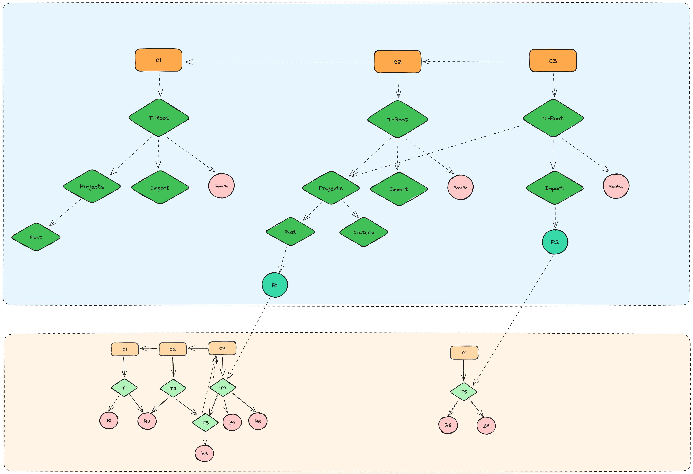

## 1.Basic Design of Mega 



将Mega的存储结构拆分为两部分进行设计
- Part1：树形目录结构（接下来称为Mega Directory），其为一个git仓库，维护Projects，Import等Mega 目录和其下的README文件，对于需要存储的git仓库，将其存储为一个blob文件（图中R1，R2文件）（接下来称为b-link文件），具体的内容可以参考lfs的spec，如:

    ```bash
    version https://mega.com/directory/spec/v1
    path /path/to/your/repo
    ```
- Part 2：Mega托管的git仓库本身，该部分则是通过将Packfile解析后的内容存储到数据库相应的表来进行维护

### Clone的大致流程

- 当进行clone时，首先会遍历最新提交的tree，并判断每个blob文件是否是b-link文件，如果是则获取指向的git仓库的大小，如果本次clone下所有b-link文件指向的仓库操作一个阈值，那么直接结束clone并返回错误.
- 未超出大小的前提下，则将所有b-link指向git仓库的最新目录树替换b-link文件，并**递归重新计算**Mega Directory中涉及到的tree节点和commit的hash，这样才能把完整的目录发送给client.
- 因为b-link只是记录了一个项目路径，并且一旦创建后文件本身不会变化，所以托管的git仓库的commit不会影响Mega Directory
- 如果对Mega Directory下的目录和文件进行修改，则需要产生新的commit，用于进行历史版本的回溯
- 值得注意的是Mega Directory 回溯，不会导致b-link对应的git仓库进行回溯，但是如果Mega Directory 在回溯中失去了b-link文件，则也会失去对应的git仓库


## 2. Database Design（TODO）


## 3. clone时遵守的规则（TODO）

### ✅ git clone root：
- 1个commit，只包含一级目录Projects，Import 和ReadME
- 用于改readme等文件，添加和修改其他文件会报错
- 需要记录目录的历史版本
- 判断contains repo

### ✅ git clone projects：
- 1个commit C-Project，包含底下的所有项目，根据目录计算出projetcs🌲
- 需要给定阈值来限制clone的大小，超出则通过api来进行修改

### ✅ git clone projects/repo：
- 1个commit，将C3的parent改为空

### ✅ git clone projects/repo/T3 ： 
- 1个commit，将C3的parent改为空，并指向T3

### ❌ git clone import：
- 不允许，因为不能把多个项目合并成一个项目

### ✅ git clone import/repo：
- 包含所有历史提交的标准clone

### ❌ git clone import/repo/T3：
- 不允许子目录clone

## 4. Prerequisites

- You need to execute SQL files in a specific order to init the database.

    For example using `PostgreSQL`, execute the files under `sql\postgres`:

        pg_20230803__init.sql

    or if your are using `Mysql`, execute scripts:

        mysql_20230523__init.sql


- Generating entities: 
Entities can be generated from the database table structure with the following command

`sea-orm-cli generate entity -u "mysql://${DB_USERNAME}:${DB_SECRET}@${DB_HOST}/mega"  -o database/entity/src` 