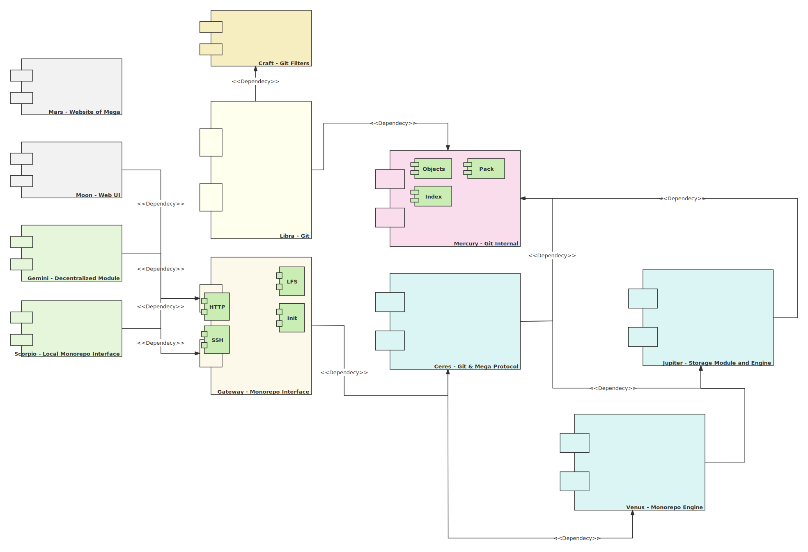

# Development

## Prerequisites

- Rust (stable; workspace edition 2024)
- [Buck2](https://buck2.build/) and [cargo-buckal](https://github.com/buck2hub/cargo-buckal) for CI-parity builds (see root [README.md](../README.md))
- PostgreSQL or SQLite (configured in `config/config.toml`)
- Optional: Docker for the [demo stack](../docker/README.md)

## Clone and build

```bash
git clone https://github.com/web3infra-foundation/mega.git
cd mega
git submodule update --init --recursive
cargo build -p mono
```

## Configuration

Default config: [config/config.toml](../config/config.toml).

- **Path:** `./config.toml` in the working directory, or `--config /path/to/config.toml`
- **Environment:** `MEGA_*` overrides nested keys with `__` (e.g. `MEGA_LOG__LEVEL` → `log.level`)
- **Substitution:** `${base_dir}` and `${key.subkey}` in string values (see `common/src/config.rs`)

Use PostgreSQL `JSON` columns (not arrays) for SQLite compatibility.

## Run the server

```bash
cargo run --bin mono -- service http
# or multiple protocols:
cargo run --bin mono -- service multi http ssh
```

Database migrations apply automatically on first `Storage::new` when the `migrate` feature is enabled (default for `mono`). See [jupiter-migrate/README.md](../jupiter-migrate/README.md).

Swagger UI: `http://localhost:8000/swagger-ui` (default HTTP port).

## Post-start initialization (optional)

To seed Buckal bundles and third-party imports via API:

```bash
python3 scripts/init_mega/init_mega.py --base-url http://127.0.0.1:8000
```

See [scripts/init_mega/README.md](../scripts/init_mega/README.md).

## Git smoke test

```bash
git remote add local http://localhost:8000/projects/mega.git
git push local main
git clone http://localhost:8000/projects/mega.git /tmp/mega-clone
```

Import repos use paths under `/third-party/` (configurable via `import_dir`).

## Tests

### Unit tests

```bash
cargo test -p ceres --features migrate
cargo test -p mono
```

### Workspace integration tests

```bash
cargo test --workspace --test '*' -- --nocapture
```

- `--workspace` — all packages
- `--test '*'` — integration test binaries only (not unit tests in `src/`)

### Pre-submit checks

```bash
cargo clippy --all-targets --all-features -- -D warnings
cargo +nightly fmt --all --check
cargo buckal build
```

## Architecture

See [architecture.md](architecture.md) and [ceres/README.md](../ceres/README.md).



## Comment and import order

File headers use `//!`, public items use `///`.

Rust import order:

1. Standard library
2. Third-party crates
3. Workspace crates
4. Crate-internal modules

Group sections with blank lines; alphabetize within each group. Prefer `crate::` over `super::` / `self::` in imports.
