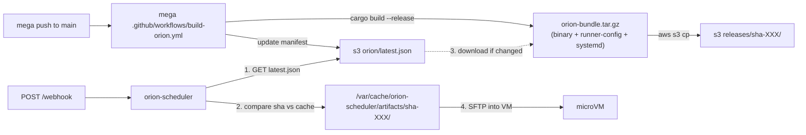

# Orion 构建产物分发设计

把 orion 构建产物从「本地 mega 目录 cp」改为「mega 仓库 GitHub Action 构建并推 S3，orion-scheduler 在每次 webhook 时从 S3 按需拉取」。沿用现有 [`.github/workflows/build-custom-image.yml`](.github/workflows/build-custom-image.yml) 的 OIDC + S3 通道；采用 pull 模型，避免 orion-scheduler 暴露入站接口给 CI。

## 背景：现状的问题

[`src/orion_deployer.rs`](src/orion_deployer.rs) 直接读两个本地路径：

```rust
// 路径从 target_config.json 读取
let orion_source_dir = config.orion_source_dir();
let orion_binary_path = config.orion_binary_path();
const ORION_TARGET_DIR: &str = "/home/orion/orion-runner";
```

由此带来三个隐含约束：

1. orion-scheduler 必须和 mega 源码在**同一台机器**
2. orion 二进制是开发者本地 `cargo build` 出来的 **debug 模式**，不可复现，约 500MB
3. 没有版本概念，每次 webhook 都用「当前 target 目录里那个」

## 总体架构



## 1. S3 layout（mega Action 与 orion-scheduler 共识）

```
s3://${S3_BUCKET}/orion-scheduler/
├── debian-13-buck2.qcow2                          # 已存在
└── orion/
    ├── latest.json                                # 可变指针
    └── releases/
        └── sha-<short8>/                          # 不可变，按 commit 落
            ├── orion-bundle.tar.gz                # binary + runner-config + systemd
            └── orion-bundle.tar.gz.sha256
```

`latest.json` schema：

```json
{
  "version": "0.1.0",
  "commit_sha": "abc123def456...",
  "commit_short": "abc123de",
  "built_at": "2026-05-20T08:00:00Z",
  "bundle_url": "https://${S3_BUCKET}.s3.${AWS_REGION}.amazonaws.com/orion-scheduler/orion/releases/sha-abc123de/orion-bundle.tar.gz",
  "bundle_sha256": "..."
}
```

`orion-bundle.tar.gz` 内部结构（与 deployer 期望的相对路径一致）：

```
orion-bundle/
├── orion                       # release 二进制（约 50-100MB，远小于 debug 的 500MB）
├── runner-config/
│   ├── run.sh
│   ├── scorpio.toml
│   ├── preflight.sh
│   ├── cleanup.sh
│   └── .env.prod
└── systemd/
    └── orion-runner.service
```

## 2. mega 仓库新增 Action（不在本仓库改）

新文件 `.github/workflows/build-orion.yml`（在 mega 仓库里）。结构参考本仓库 [`.github/workflows/build-custom-image.yml`](.github/workflows/build-custom-image.yml) 的 OIDC 写法，复用相同的 `secrets.AWS_ROLE_ARN` / `secrets.AWS_REGION` / `secrets.S3_BUCKET`。

触发：

- `push` to `main`（自动）
- `workflow_dispatch`（手动）

主要步骤：

1. checkout mega
2. `cargo build --release -p orion`
3. `tar czf orion-bundle.tar.gz orion runner-config systemd`
4. `sha256sum orion-bundle.tar.gz > orion-bundle.tar.gz.sha256`
5. AWS OIDC configure
6. `aws s3 cp` 到 `releases/sha-${SHORT_SHA}/`
7. 生成 `latest.json` 并 `aws s3 cp` 到 `orion/latest.json`（`--cache-control "max-age=60"` 避免长缓存）

## 3. orion-scheduler 侧改造

### 3.1 新增模块 `src/artifact_fetcher.rs`

职责：

```rust
pub struct ArtifactManifest {
    pub commit_short: String,
    pub bundle_url: String,
    pub bundle_sha256: String,
    pub built_at: String,
}

pub struct ResolvedArtifact {
    pub root_dir: PathBuf,             // e.g. /var/cache/.../sha-abc123de/
    pub orion_binary: PathBuf,         // root_dir/orion
    pub runner_config_dir: PathBuf,    // root_dir/runner-config
    pub systemd_service: PathBuf,      // root_dir/systemd/orion-runner.service
    pub manifest: ArtifactManifest,
}

pub async fn ensure_latest(config: &ArtifactConfig) -> Result<ResolvedArtifact>;
```

行为：

1. `reqwest` GET `latest.json` URL
2. 在 `cache_dir` 下查找 `sha-<short>/` 目录是否已存在且 `.complete` 标记文件存在
3. 若不存在：原子下载（temp 文件 → 校验 SHA256 → `tar -xzf` 解压 → 写 `.complete` 标记）
4. 返回 `ResolvedArtifact` 给调用方
5. GC：保留最近 N=3 个版本，其余删除

### 3.2 `orion_deployer.rs` 改造

将硬编码常量 `ORION_SOURCE_DIR` 和二进制路径全部去掉，`deploy_orion_in_vm` 函数签名增加 `artifact: &ResolvedArtifact` 参数。内部所有路径替换为：

- `PathBuf::from(orion_source_dir).join("runner-config").join(file)` → `artifact.runner_config_dir.join(file)`
- `PathBuf::from(orion_source_dir).join("systemd").join(...)` → `artifact.systemd_service.clone()`
- `PathBuf::from(orion_binary_path)` → `artifact.orion_binary.clone()`

### 3.3 `handle_update` 加 Step 0

[`src/orion_deployer.rs`](src/orion_deployer.rs)：在 Step 1（读 config）之后、Step 3（创建 VM）之前插入：

```rust
let artifact = artifact_fetcher::ensure_latest(&config.artifact()).await?;
info!("[orion-deploy] Using orion version: {} ({})",
      artifact.manifest.commit_short, artifact.manifest.built_at);
```

然后传给 `deploy_orion_in_vm(&machine, &artifact)`。

### 3.4 `target_config.json` 加配置块

```json
{
  "log_dir": "...",
  "default_image": "buck2",
  "orion_artifact": {
    "manifest_url": "https://${S3_BUCKET}.s3.${REGION}.amazonaws.com/orion-scheduler/orion/latest.json",
    "cache_dir": "/var/cache/orion-scheduler/artifacts",
    "keep_versions": 3
  },
  "custom_images": { ... },
  "targets": { ... }
}
```

`config.rs` 增加 `ArtifactConfig` struct 和 `Config::artifact() -> &ArtifactConfig` 方法。

### 3.5 `state.rs` 增加版本暴露

[`src/state.rs`](src/state.rs) 的 `VmInfo` 增加：

```rust
pub orion_version: Option<String>,   // e.g. "sha-abc123de"
```

[`src/handlers.rs`](src/handlers.rs) 的 `/status` 响应里把这个字段透出，方便排障。

### 3.6 Cargo 依赖

[`Cargo.toml`](Cargo.toml) 增加：

- `reqwest = { version = "0.12", features = ["rustls-tls", "stream"] }`（HTTP 下载，rustls 避免 OpenSSL 依赖）
- `tar = "0.4"`（解压）
- `flate2 = "1.0"`（gzip）

`sha2` 已有，不动。

### 3.7 向后兼容（escape hatch）

`orion_artifact` 字段缺失或 `manifest_url` 为空 → 回退到旧行为，从 `target_config.json` 指定的本地路径读，保留开发者本地迭代体验。`artifact_fetcher::ensure_latest` 在该情况下返回一个指向本地路径的 `ResolvedArtifact`，下游代码无差别。

## 4. S3 访问凭证（host 侧）

orion-scheduler 拉 S3 有三种方案，按从简到复杂排：

- **A. orion 这个 prefix 设为 public-read**：host 用纯 HTTPS GET，零凭证；用 `bundle_sha256` 校验完整性。**推荐这个**，因为 orion 是开源项目，binary 不敏感。
- B. 给 host 一个只读 IAM key 写到 `~/.aws/credentials`
- C. CI 生成 pre-signed URL 写进 `latest.json`（TTL 7 天，到期需重发）

实施时先按 A 走，bucket policy 给 `orion-scheduler/orion/*` 加 `s3:GetObject` Allow `Principal: *`。

## 5. 实施顺序建议

1. 先在 orion-scheduler 这边加 `artifact_fetcher` 模块和配置开关，**带本地 FS fallback** —— 可以单独 merge、零行为变更
2. 在 mega 仓库加 build-orion Action，跑通一次 S3 上传，生成第一个 `latest.json`
3. 在某个 target 的 target_config 里配上 `manifest_url`，触发一次 webhook 验证
4. 全量切换：所有 target 都用 manifest_url，删掉本地 FS fallback（可选，建议保留 fallback 长期支持本地开发）

## 6. 待确认的小决策

| 决策点 | 默认选择 | 备选 |
| --- | --- | --- |
| Action 编译模式 | `--release`（二进制小一个数量级） | 保留 debug 选项给本地 fallback |
| 缓存目录权限 | `/var/cache/orion-scheduler/`（root 跑无问题） | 改 systemd user 时配 tmpfiles.d |
| GC 策略 | 保留最近 N=3 版本 | 按时间维度（如 7 天） |
| manifest 拉取失败 | fail-fast 返回 webhook 错误 | 降级用最后一次 cache |

## 7. 实施 TODO

- [ ] 在 mega 仓库新增 `.github/workflows/build-orion.yml`：release 编译 + 打包 + S3 上传 + 写 `latest.json`
- [ ] 确定 S3 布局：`orion-scheduler/orion/{latest.json, releases/sha-XXX/orion-bundle.tar.gz}`
- [ ] [`target_config.json`](target_config.json) 增加 `orion_artifact` 配置块，并在 `config.rs` 中加对应的 `ArtifactConfig` + accessor
- [ ] 新增 `src/artifact_fetcher.rs`：GET `latest.json` → 比对 `cache_dir` 里的 sha → 按需下载解压 → SHA256 校验 → 返回 `ResolvedArtifact`
- [ ] [`src/orion_deployer.rs`](src/orion_deployer.rs) 去掉硬编码常量，`deploy_orion_in_vm` 接受 `ResolvedArtifact` 参数
- [ ] `handle_update` 在 Step 1 后插入 `artifact_fetcher::ensure_latest`，传给下游
- [ ] [`src/state.rs`](src/state.rs) 的 `VmInfo` 增加 `orion_version` 字段，`/status` 端点透出
- [ ] [`Cargo.toml`](Cargo.toml) 加入 `reqwest` (rustls), `tar`, `flate2`
- [ ] `manifest_url` 缺失时 fallback 到 `target_config.json` 指定的本地路径，保留本地开发体验
- [ ] 给 S3 bucket 的 `orion-scheduler/orion/*` 加 public-read 策略（或选取其他凭证方案）
- [ ] 更新 [`TESTING.md`](TESTING.md) / [`DESIGN.md`](DESIGN.md) 说明新的 artifact 流和调试方法（如何查看当前版本、如何手动刷缓存）
