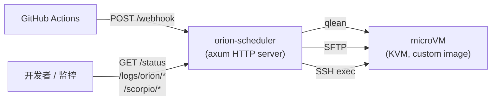
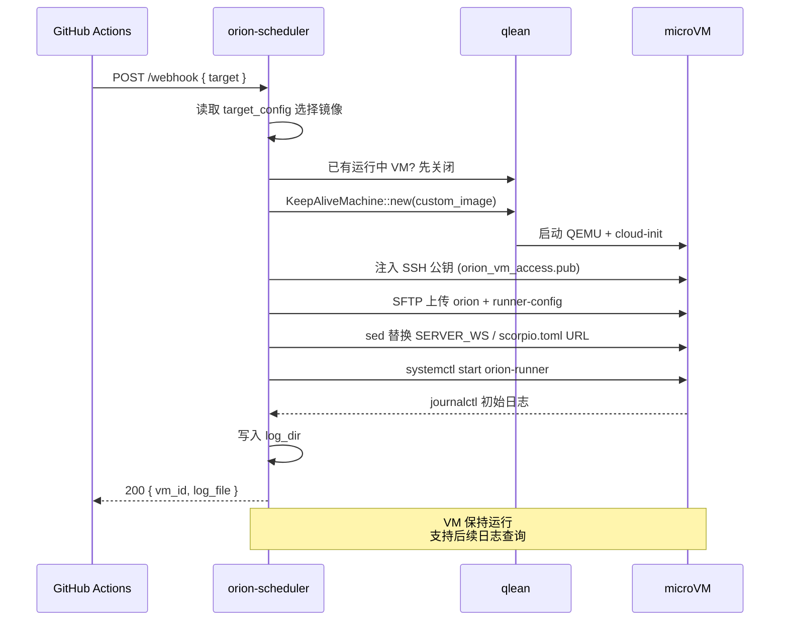

# Orion Scheduler

Orion Scheduler 是一个常驻运行的服务，负责接收来自 GitHub Actions 的 Webhook 事件，通过 [qlean](https://crates.io/crates/qlean) 拉起 QEMU/KVM 微型虚拟机，将 Orion 二进制文件及 runner 配置通过 SFTP 推送至 VM 内部，启动 `orion-runner` systemd 服务，并保持虚拟机长期运行以支持实时日志拉取。



---

## 快速开始

### 前置要求


| 项目      | 要求                                                                                              |
| ------- | ----------------------------------------------------------------------------------------------- |
| CPU 虚拟化 | 需启用 KVM；AWS EC2 环境应选用支持嵌套虚拟化的实例类型（`C8i` / `M8i` / `R8i`），并在实例 CPU 选项中开启 Nested virtualization |
| NBD 模块   | 构建自定义镜像前需加载：`sudo modprobe nbd max_part=8`                                                 |
| Rust    | 1.85 及以上（项目采用 Rust 2024 edition）                                                               |
| 网络      | 主机需存在 `qlbr0` 网桥；`/etc/qemu/bridge.conf` 中应包含 `allow qlbr0`                                |
| 镜像      | 需预先构建完成 `debian-13-buck2.qcow2`（参见[自定义镜像](#自定义镜像)）                                      |


### 最小配置（`target_config.json`）

从 `target_config.json.template` 复制并修改：

```json
{
  "log_dir": "/var/log/orion-scheduler",
  "orion_source_dir": "/home/user/mega/orion",
  "orion_binary_path": "/home/user/mega/target/debug/orion",
  "ssh_public_key_path": "~/.ssh/orion_vm_access.pub",
  "targets": {
    "aws-gitmega": {
      "server_ws": "wss://orion.gitmega.com/ws",
      "scorpio_base_url": "https://git.gitmega.com",
      "scorpio_lfs_url": "https://git.gitmega.com"
    }
  }
}
```

配置文件路径可通过 `CONFIG_PATH` 环境变量指定（默认：`target_config.json`）。

---

## 工作流程

`POST /webhook` 将触发一次完整的部署流程：



详细实现参见 [`src/orion_deployer.rs`](src/orion_deployer.rs) 中的 `handle_update` 函数。

---

## API 端点


| 方法    | 路径                    | 说明                                    | 响应                                                          |
| ----- | --------------------- | ------------------------------------- | ----------------------------------------------------------- |
| GET   | `/health`             | 服务健康检查                                 | `{ "status": "healthy", ... }`                            |
| GET   | `/webhook`            | Webhook 端点连通性检查                         | `{ "status": "ok", "vm_id": null, ... }`                |
| POST  | `/webhook`            | 触发部署，详见下方参数说明                        | `{ "status": "ok", "vm_id", "orion_log_file" }`          |
| GET   | `/status`             | 当前虚拟机状态                               | `{ "status": "running"\|"no_vm", vm_id, vm_ip, uptime_secs }` |
| GET   | `/logs/orion/stream`  | SSE 流式推送，每 2 秒推送新增日志                   | `text/event-stream`                                       |
| GET   | `/scorpio/status`     | Scorpio FUSE 挂载点、目录、进程状态               | JSON                                                       |
| GET   | `/scorpio/config`     | 直接读取 VM 内 `/home/orion/orion-runner/scorpio.toml` | `{ "path", "content" }`                                  |
| POST  | `/shutdown`           | 仅关闭虚拟机，服务进程保持运行                        | `{ "status": "ok", "message" }`                          |


### POST /webhook 请求体

```bash
curl -X POST http://localhost:8080/webhook \
  -H 'Content-Type: application/json' \
  -d '{"target": "aws-gitmega"}'
```


| 字段                | 类型      | 必填   | 说明                                                       |
| ----------------- | ------- | ---- | -------------------------------------------------------- |
| `target`          | string  | 是    | 必须在 `target_config.json` 的 `targets` 中存在                    |
| `action`          | string  | 否    | GitHub Actions 事件类型，仅作日志记录                             |
| `image_path`      | string  | 否    | 本地 qcow2 镜像路径                                           |
| `image_url`       | string  | 否    | 远程 HTTPS URL                                              |
| `image_digest`    | string  | 条件必填 | 镜像 SHA256/SHA512 校验和，提供 `image_path` 或 `image_url` 时必须指定 |
| `image_disk_gb`   | u32     | 否    | 虚拟机磁盘大小（GB）                                           |
| `image_cpus`      | u32     | 否    | 虚拟 CPU 数量                                               |
| `image_memory_mb` | u32     | 否    | 内存大小（MB）                                               |

> `image_path` 与 `image_url` 互斥，不可同时指定。提供镜像参数时 `image_digest` 必须提供（格式：`sha256:...` 或 `sha512:...`）。资源参数未指定时使用默认值（磁盘：镜像内建大小，CPU：4，内存：8192MB）。

---

## 自定义镜像

虚拟机启动时间和部署延迟主要取决于镜像是否预装了 Rust / buck2 / apt 包。`scripts/build-custom-image.sh` 通过纯 chroot 方式将工具链直接写入镜像，**无需启动虚拟机**，整个构建过程约需 5 分钟。

### 一键构建

```bash
sudo modprobe nbd max_part=8
sudo bash scripts/build-custom-image.sh
```

脚本自动完成以下步骤：

1. 复制 `debian-13-generic-amd64.qcow2` 基础镜像并扩容至 15GB
2. 通过 `qemu-nbd` 挂载、`growpart` + `resize2fs` 扩展分区
3. chroot 进入镜像并安装：
   - Rust 1.95.0 toolchain（在 host 上预下载 tarball，避免 chroot 内 DNS 问题）
   - apt 包：`clang lld pkg-config protobuf-compiler zstd fuse curl git seccomp libseccomp-dev libpython3-dev openssl libssl-dev build-essential`
   - buck2（`2026-04-15` 版本）
   - SSH 公钥写入 `/root/.ssh/authorized_keys`
   - 软链 `rustc` / `cargo` → `/usr/local/bin/`，确保默认 PATH 可找到
4. chroot 末尾执行 `dd` 写满空闲块再删除，利于压缩
5. `qemu-img convert -O qcow2 -c` 压缩（**15GB → ~1.2GB**，节省 90%+）
6. 发布至 qlean 期望的扁平路径：`~/.local/share/qlean/images/debian-13-buck2.qcow2`，并更新 `debian-13-buck2.json` 中的 sha256 digest

### 安全特性


| 特性       | 实现方式                                                    |
| -------- | ------------------------------------------------------- |
| 失败自动清理  | `trap cleanup EXIT INT TERM HUP` 卸载 bind mounts + 断开 NBD  |
| 严格错误捕获  | `set -eo pipefail`，chroot 内任何步骤失败立即中止                   |
| 锁检测     | 发布前用 `qemu-img info` 探测目标文件，若被运行中 VM 占用则跳过覆盖        |
| 设备同步    | 使用 `udevadm settle` + 轮询代替固定 `sleep`                      |


### 预装内容速查


| 组件                    | 版本         | 位置                                          |
| --------------------- | ---------- | ------------------------------------------- |
| Rust                  | 1.95.0     | `/root/.cargo/bin/`，软链至 `/usr/local/bin/` |
| buck2                 | 2026-04-15 | `/usr/local/bin/buck2`                     |
| clang / lld           | 19.x       | apt 系统路径                                    |
| git / protoc / zstd / openssl | apt 当前版本   | 系统路径                                      |
| SSH key               | `~/.ssh/orion_vm_access.pub` | `/root/.ssh/authorized_keys`          |


---

## 配置说明

完整配置 schema 参见 [`DESIGN.md`](DESIGN.md) 第 5 节。

### 顶层字段


| 字段                    | 类型     | 默认                          | 说明                      |
| --------------------- | ------ | --------------------------- | ----------------------- |
| `log_dir`             | string | `/var/log/orion-scheduler`   | Orion 启动期日志落盘目录          |
| `orion_source_dir`    | string | 无默认值（必填）                | Orion 源码目录（含 runner-config、systemd） |
| `orion_binary_path`   | string | 无默认值（必填）                | Orion 二进制文件路径            |
| `ssh_public_key_path` | string | 无默认值（必填）                | SSH 公钥路径                 |
| `targets`             | map    | `{}`                        | 部署目标定义，至少一项            |


### `targets[name]`


| 字段                 | 类型      | 说明                                       |
| ------------------ | ------- | ---------------------------------------- |
| `server_ws`        | string  | Orion WebSocket URL，写入 VM 内 `.env` 的 `SERVER_WS` |
| `scorpio_base_url` | string  | 写入 `scorpio.toml` 的 `base_url`               |
| `scorpio_lfs_url`  | string  | 写入 `scorpio.toml` 的 `lfs_url`                |


### 内置 target（[`target_config.json`](target_config.json) 默认）


| target        | SERVER_WS                      | scorpio base_url           |
| ------------- | ------------------------------ | -------------------------- |
| `aws-gitmega` | `wss://orion.gitmega.com/ws`   | `https://git.gitmega.com`  |
| `aws-gitmono` | `wss://orion.gitmono.com/ws`   | `https://git.gitmono.com`  |
| `gcp-buck2hub` | `wss://orion.buck2hub.com/ws` | `https://git.buck2hub.com` |


---

## 目录结构

```text
orion-scheduler/
├── src/
│   ├── main.rs                # axum 入口 + 信号处理
│   ├── handlers.rs            # HTTP 端点 + 日志格式化
│   ├── state.rs               # AppState：VM info + KeepAliveMachine
│   ├── config.rs              # 读取/解析 target_config.json
│   ├── keep_alive.rs          # qlean::Machine 持久化包装
│   ├── orion_deployer.rs      # handle_update 编排（webhook 主流程）
│   ├── vm_manager.rs          # SFTP 上传、sed 环境变量替换、systemctl 启停
│   └── vm_cleanup.rs          # qlean runs 目录泄漏清理
├── scripts/
│   └── build-custom-image.sh  # chroot 离线预装 + qcow2 压缩 + 发布
├── .github/workflows/
│   └── build-custom-image.yml # 镜像 CI（手动触发，上传 S3）
├── target_config.json.template # 配置模板
├── README.md                  # 本文档
├── DESIGN.md                  # 详细设计、生命周期、配置 schema
├── TESTING.md                 # 调试方法、API 测试、常见问题
└── ARTIFACT.md                # 产物分发演进方案（Action + S3 pull）
```

---

## 信号与环境变量


| 信号 / 动作                    | VM   | 服务进程      | 说明                                                    |
| ------------------------- | ---- | --------- | ----------------------------------------------------- |
| `Ctrl+C` / SIGINT          | 关闭   | 退出        | 优雅关闭                                                  |
| SIGTERM                    | 关闭   | 退出        | 同上                                                  |
| SIGQUIT                    | 关闭   | 退出        | 同上                                                  |
| `POST /shutdown`           | 关闭   | **保持运行**  | 仅回收虚拟机                                               |
| `pkill -9 orion-scheduler` | 残留   | 强制终止      | 不优雅关闭，虚拟机将变为孤儿进程，需手动清理                                  |


| 环境变量        | 默认                    | 说明                  |
| ----------- | --------------------- | ------------------- |
| `CONFIG_PATH` | `target_config.json`   | 配置文件路径               |
| `RUST_LOG`    | `info`                | tracing 日志级别，常用 `debug` |


---

## 调试与 SSH 进入 VM

部署完成后从 `/status` 获取 `vm_ip`，使用构建脚本预装的 SSH 密钥登录：

```bash
ssh -i ~/.ssh/orion_vm_access root@<vm_ip>
```

完整调试流程参见 [`TESTING.md`](TESTING.md)。

---

## 演进方向

当前 `orion` 二进制路径通过 `target_config.json` 的 `orion_binary_path` 配置，镜像路径通过 `image_path` 或 `image_url`（API 参数）配置。

这要求 orion-scheduler 必须和 mega 源码、镜像构建产物在**同一台机器**上。后续演进方向为：

- mega 仓库 GitHub Action 构建 release 版二进制 → 推送至 S3（带 sha 版本化 + `latest.json` manifest）
- 镜像构建 Action 上传至 S3 + manifest，host 端复用 qlean 内置的 HTTPS 拉取 + sha 校验
- orion-scheduler 每次 webhook 按 manifest 拉取最新版本，本地 cache 命中则跳过下载

详细设计参见 [`ARTIFACT.md`](ARTIFACT.md)。
