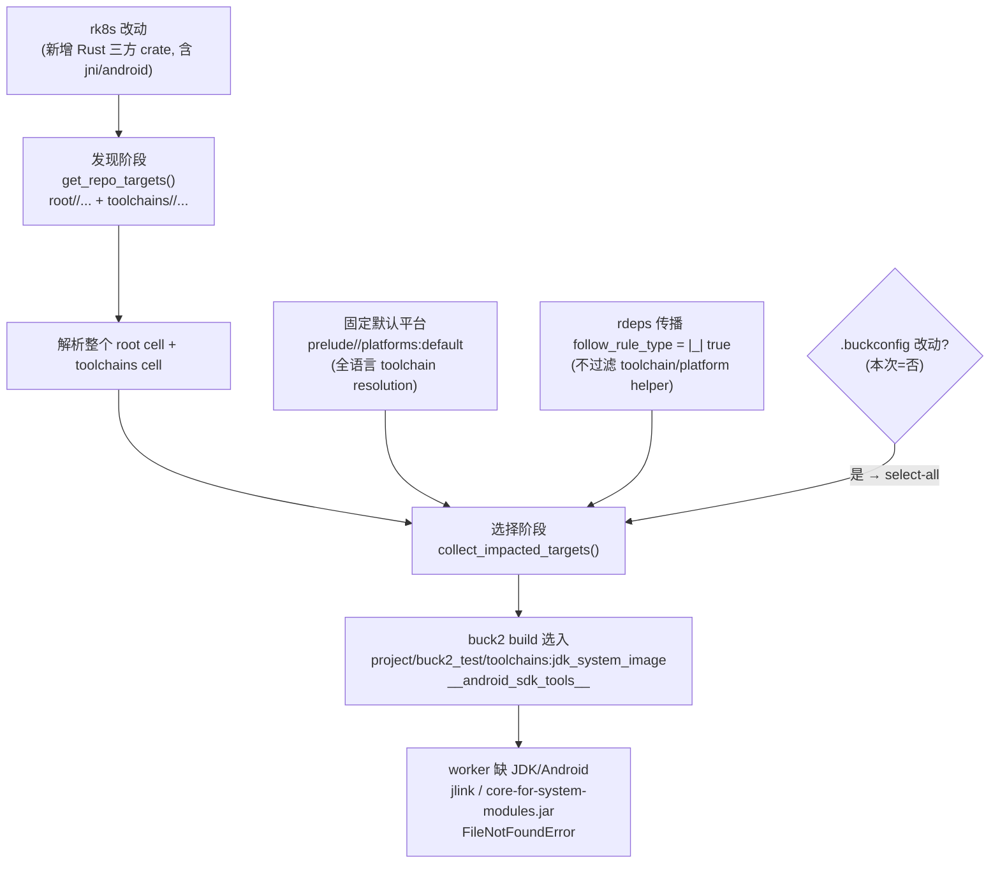

# Target Discovery 扫描范围过大问题分析

本文档记录 Orion worker 在做 Buck2 增量构建时，**target discovery（目标发现）与影响传播范围过大**，导致一个纯 Rust 改动（如 `rk8s`）会拉起与之无关的 JVM / Android toolchain，并因 worker 镜像缺少这些环境而构建失败的问题。

涉及代码主要在 `orion` crate（worker 端），而非 `orion-scheduler` 本身；本文放在 `orion-scheduler/` 下作为问题归档与修改方案说明。

> 重要澄清：`project/buck2_test/toolchains:jdk_system_image`、`__android_sdk_tools__` 等 **不代表 `buck2_test` 业务代码依赖 JVM/Android**。它们只是 JVM/Android toolchain / platform helper target 的**定义位置**恰好在 `project/buck2_test/toolchains` 这个包下。这些 helper 被拉进来，是因为 Orion 统一使用了**全语言默认平台** `prelude//platforms:default`，并且影响传播不过滤 toolchain/platform 节点——而不是 `rk8s` 或 `buck2_test` 真的需要 Java/Android。

---

## 1. 问题现象

CL（例如 `#UYXIYYNJ`）只新增了 `rk8s` 目录下的 Rust 代码、`rk8s/third-party/rust/crates/**` 的三方依赖 BUCK，以及 `rk8s/toolchains` 的 Buck 定义，**与 `project/buck2_test` 无关**。但 worker 构建时却出现：

```
Action failed: root//project/buck2_test/toolchains:jdk_system_image (create_jdk_system_image)
  FileNotFoundError: [Errno 2] No such file or directory:
    PosixPath('/usr/local/java-runtime/impl/17/bin/jlink')
```

以及后续：

```
FileNotFoundError: [Errno 2] No such file or directory:
  buck-out/.../__android_sdk_tools__/core-for-system-modules.jar
```

也就是说：**改 `rk8s`（纯 Rust）却触发了定义在 `project/buck2_test/toolchains` 下的 JDK / Android toolchain helper 构建**。

几个关键事实：

- `.buckconfig` 里只有 4 个 cell：`root` / `prelude` / `toolchains` / `none`。`rk8s` 和 `project/buck2_test` 都在 **`root` cell 下**，是目录而非独立 cell。

```1:5:.buckconfig
[cells]
  root = .
  prelude = prelude
  toolchains = toolchains
  none = none
```

- 因此“按 cell 收窄”无效：只要扫 `root//...` 就会把 `project/buck2_test` 一起带进来。
- 本次 worker 日志里的改动列表全部位于 `rk8s/**`，**没有看到 `.buckconfig` 变更**。所以本次更可能是“默认平台 + 不过滤 toolchain 的影响传播”导致，而非 `.buckconfig` 触发的 select-all（见 2.3，仍是潜在放大源之一）。

---

## 2. 根因分析

worker 端的目标发现流程在 [orion/src/buck_controller.rs](orion/src/buck_controller.rs)：`get_build_targets()` 对 **base（改动前）** 和 **diff（改动后）** 两份快照分别跑 `buck2 targets` 构建完整图，再由 `collect_impacted_targets()` 计算受影响集合，最后 `buck2 build` 这些 target。

放大效应来自下面几条**叠加**的路径。

### 2.1 发现阶段：对所有 cell 跑 `//...`

`get_repo_targets()` 用 `get_all_cell_patterns()` 拼出所有 cell 的 `//...` 模式并整体查询：

```348:356:orion/src/buck_controller.rs
        // If cells info is provided, query all cells; otherwise just query root cell
        if let Some(cells_info) = cells {
            let cell_patterns = cells_info.get_all_cell_patterns(repo_path);
            tracing::debug!("Querying targets for cells: {:?}", cell_patterns);
            command.args(&cell_patterns);
        } else {
            // Default: only query root cell
            command.arg("//...");
        }
```

`get_all_cell_patterns()` 会返回 `root//...`、`toolchains//...`（排除 `prelude` / `none` 与不存在的目录）：

```278:304:orion/buck/cells.rs
    pub fn get_all_cell_patterns(&self, project_root: &Path) -> Vec<String> {
        self.cells
            .iter()
            .filter(|(cell_name, cell_data)| {
                let cell_str = cell_name.as_str();

                // Exclude known special/placeholder cells
                if cell_str == "prelude" || cell_str == "none" {
                    return false;
                }

                // Check if the cell directory actually exists
                let cell_path = project_root.join(cell_data.path.as_str());
                if !cell_path.exists() {
                    return false;
                }

                true
            })
            .map(|(cell_name, _)| format!("{}//...", cell_name.as_str()))
            .collect()
    }
```

后果：查询 `root//...` 会**解析整个 `root` cell 的所有包**（含 `project/buck2_test/toolchains`），查询 `toolchains//...` 会**初始化整个 `toolchains` cell**，即便本次只改了 `rk8s`。

### 2.2 关键根因：固定全语言默认平台 + 不过滤 toolchain 的影响传播

这是“为什么会真正去 build JVM/Android helper”的核心。

1. 发现与构建都钉死在 `prelude//platforms:default` 这一**全语言默认平台**：

```193:207:orion/buck/run.rs
pub fn targets_arguments() -> &'static [&'static str] {
    &[
        "targets",
        "--target-platforms",
        "prelude//platforms:default",
        "--streaming",
        "--keep-going",
        ...
    ]
}
```

```1203:1217:orion/src/buck_controller.rs
            .arg("build")
            .args(["--event-log", EVENT_LOG_FILE])
            .args(&targets)
            .arg("--target-platforms")
            .arg("prelude//platforms:default")
            // Avoid failing the whole build when a target is explicitly incompatible
            // with the selected platform (e.g., macOS-only crates on Linux builders).
            .arg("--skip-incompatible-targets")
```

该默认平台会把 Java/Android/CXX 等各语言 toolchain 一并纳入 configuration / toolchain resolution，相关 helper target 就定义在 `project/buck2_test/toolchains`。

2. 影响传播 `recursive_target_changes` 的 `follow_rule_type` 传的是 `|_| true`，即**沿所有 rule type 的依赖边无差别传播**，不区分业务 target、toolchain target、platform helper：

```467:469:orion/src/buck_controller.rs
fn collect_impacted_targets(base: &Targets, diff: &Targets, changes: &Changes) -> Vec<TargetLabel> {
    let immediate = diff::immediate_target_changes(base, diff, changes, false);
    let recursive = diff::recursive_target_changes(diff, changes, &immediate, None, |_| true);
```

3. 叠加效果：`rk8s` 新增了大量三方 Rust crate（其中包含 `jni`、`jni-sys`、`rustls-platform-verifier-android` 等 **Android/JNI 相关 Rust crate**）。这些新增 target 在 `prelude//platforms:default` 下做 configuration / toolchain resolution 时，会把对应的 JVM/Android toolchain helper 作为依赖引入；而 rdeps 传播又不过滤这些 helper，于是 `project/buck2_test/toolchains:jdk_system_image` 等被选入 `buck2 build`，最终在缺环境的 worker 上 `jlink` / `core-for-system-modules.jar` 报错。

> 结论：引入点是 **“全语言默认平台 + 不过滤 toolchain/platform 的影响传播”**，叠加 `rk8s` 三方 crate 中的 Android/JNI 依赖；不是 `buck2_test` 业务代码主动依赖 Java/Android。

### 2.3 次要放大源：`.buckconfig` 变更触发 select-all

若某个 CL 改了根 `.buckconfig`（或 `.buckroot` / `.bazelrc` / `.buckversion`，常见于注册新 cell/toolchain），`immediate_target_changes()` 会进入“通用文件”分支，把**整张图里所有带 Buck 依赖的目标**都标记为受影响：

```248:261:orion/src/repo/diff.rs
    if changes.cell_paths().any(is_buckconfig_change) {
        let mut ret = GraphImpact::from_non_recursive(
            diff.targets()
                .map(|t| (t, ImpactTraceData::new(t, RootImpactKind::UniversalFile)))
                .filter(|(t, _)| {
                    is_target_with_buck_dependencies(t)
                        || is_target_with_changed_ci_srcs(t, changes)
                })
                .filter(|(t, _)| matches_ci_srcs_must_match(&t.ci_srcs_must_match, changes))
                .collect(),
        );
        ret.sort();
        return ret;
    }
```

本次 CL 未见 `.buckconfig` 改动，所以这不是当次直接原因，但属于同类“放大为全图”的潜在风险，需一并关注。

### 2.4 路径如何叠加



---

## 3. 现状小结

| 维度 | 当前行为 | 问题 |
|------|----------|------|
| 发现范围 | 全 cell `//...`（`root` + `toolchains`） | 解析/初始化全仓所有包与无关 toolchain |
| cell 粒度收窄 | 不适用 | `rk8s` 与 `project/buck2_test` 同在 `root` cell |
| 默认平台 | 固定 `prelude//platforms:default` | 拉入全语言 toolchain resolution（含 JVM/Android helper） |
| 影响传播 | `recursive_target_changes(..., \|_\| true)` | 不过滤 toolchain/platform helper，沿所有边传播 |
| `.buckconfig` 改动 | 触发 select-all | 任意小改动放大为全图构建（本次未触发，但是风险） |
| worker 镜像 | 已补装 JDK17 + Android SDK（治标） | 仅掩盖问题，构建仍在做无关工作、慢且脆 |

worker 镜像里补装 JDK / Android（见 [scripts/build-custom-image.sh](orion-scheduler/scripts/build-custom-image.sh)）能让构建“不报错”，但并未解决“一个 Rust 改动为何要构建 Java/Android”这一根本问题——构建仍然变慢、变脆，且引入了不必要的环境依赖。

---

## 4. 修改方案

目标：**让 target discovery 与影响传播只覆盖与本次改动相关的范围，不再为了 `rk8s` 改动而扫描/初始化全仓所有 cell，并避免把无关语言的 toolchain/platform helper 选入构建。**

下面几项可独立或组合落地。

### 方案 A：按改动路径收窄发现范围

在 `get_repo_targets()` / `get_all_cell_patterns()` 之外新增一条“按改动收窄”的路径：

1. 由 `changes` 推导出受影响的目录/包，把 `root//...` 收窄为 `root//rk8s/...` 这类**子树模式**（每个改动文件 → 其所在包/目录子树）。
2. **仅当**改动实际触及某个 cell（如 `toolchains/`）时，才把该 cell 的模式纳入查询；否则不查 `toolchains//...`。

- 优点：直接消除“扫全仓 + 初始化无关 toolchain cell”。
- 代价/风险：**可能漏掉跨目录反向依赖**（rdeps）。若 `project/foo` 依赖 `rk8s/bar`，改 `rk8s/bar` 时 `project/foo` 不会被发现。仅在“子项目相互隔离”假设下安全。
- 实现落点：`orion/buck/cells.rs` 增加 `get_scoped_patterns(changes)`；`get_repo_targets()` 接收 `changes` 并传入。

### 方案 B：过滤 toolchain / platform helper 的影响传播（与 A 互补，强烈建议）

把 `collect_impacted_targets()` 里 `recursive_target_changes` 的 `follow_rule_type` 从 `|_| true` 改为**跳过 toolchain / platform / 配置类 rule type**，并在最终 build 列表里剔除 toolchain helper target（如 `*/toolchains:*`、`jdk_system_image`、`__android_sdk_tools__` 等）。

- 优点：即便它们出现在图里，也不会被当作“要 build 的业务 target”。直接消除 `jlink` / `core-for-system-modules.jar` 这类失败。
- 代价：需要准确识别哪些 rule type 属于 toolchain/platform（可基于 rule_type 前缀或 package 路径规则），避免误伤真实业务 target。
- 实现落点：[orion/src/buck_controller.rs](orion/src/buck_controller.rs) 的 `collect_impacted_targets()`；[orion/src/repo/diff.rs](orion/src/repo/diff.rs) 的 `recursive_target_changes()`。

### 方案 C：收敛默认平台 / 按语言选择 toolchain

不再对所有发现/构建钉死 `prelude//platforms:default`，而是按改动涉及的语言/子项目选择更窄的 platform，或显式裁剪 default platform 引用的 toolchain，使纯 Rust 改动不触发 Java/Android toolchain resolution。

- 优点：从“全语言 toolchain resolution”这一源头止血。
- 代价：需要梳理 `prelude//platforms:default` 的定义与各语言 toolchain 装配方式，改动面与风险相对较高，需配合 Buck 侧配置。
- 实现落点：`orion/buck/run.rs::targets_arguments()` 与 `buck2 build` 的 `--target-platforms` 参数，以及仓库 `prelude//platforms` / `toolchains` 定义。

### 方案 D：按路径收窄 + `buck2 uquery rdeps` 补齐（保正确性）

在方案 A 基础上，对收窄得到的“种子目标”再跑 `buck2 uquery "rdeps(<universe>, <seed>)"` 补回跨目录反向依赖。

- 优点：不漏建，保持 CI 正确性。
- 代价：rdeps 查询仍需触碰较大范围的图，初始化节省有限；实现更复杂。

### 方案 E：收敛 `.buckconfig` select-all（防回归）

让 `.buckconfig` 等通用文件变更不再无脑 select-all，而是限定在受影响 cell / 子树内。本次非直接原因，但建议一并收敛以防后续回归。

### 方案对比

| 方案 | 不再扫全仓 | 不 build 无关 toolchain | 从源头去 JVM/Android resolution | 保持跨目录 rdeps 正确 | 复杂度 |
|------|-----------|-------------------------|----------------------------------|------------------------|--------|
| A 路径收窄 | 是 | 部分 | 否 | 否（可能漏建） | 低 |
| B 过滤 toolchain 传播 | 否 | 是 | 否（图里仍解析） | 是 | 低-中 |
| C 收敛默认平台 | 否 | 是 | 是 | 是 | 高 |
| D A + uquery rdeps | 部分 | 部分 | 否 | 是 | 高 |
| E 收敛 select-all | 否 | 部分 | 否 | 视实现而定 | 低-中 |

---

## 5. 推荐与待确认

推荐组合：**A（按路径收窄发现）+ B（过滤 toolchain/platform helper 传播）**。A 降低扫描/初始化范围，B 直接阻止把无关语言 toolchain helper 选入 build；两者改动面小、对当次失败最直接。若要从源头根治，再逐步推进 **C**。

待确认问题：

1. 收窄范围的单元用“改动文件所在目录子树”还是 webhook 已提供的 `repo` / `repo_prefix` 子项目边界？
2. 是否接受方案 A 可能漏掉的跨目录反向依赖（即子项目是否真的相互隔离），还是需要 D 来兜底？
3. 方案 B 中“toolchain/platform helper”的识别标准：按 rule type 前缀、按 `*/toolchains:*` 包路径，还是两者结合？
4. 是否需要同时推进 C（收敛默认平台），从源头去掉纯 Rust 改动的 JVM/Android toolchain resolution？

---

## 6. 相关代码索引

- [orion/src/buck_controller.rs](orion/src/buck_controller.rs)：`get_build_targets()`、`get_repo_targets()`、`collect_impacted_targets()`（`recursive_target_changes(..., |_| true)`）、`buck2 build`（固定 `--target-platforms prelude//platforms:default`）。
- [orion/buck/run.rs](orion/buck/run.rs)：`targets_arguments()`（发现阶段也固定 `prelude//platforms:default`）。
- [orion/buck/cells.rs](orion/buck/cells.rs)：`get_all_cell_patterns()`、`unresolve()`（路径 → cell 的映射，可复用做路径收窄）。
- [orion/src/repo/diff.rs](orion/src/repo/diff.rs)：`immediate_target_changes()`（`.buckconfig` → select-all）、`recursive_target_changes()`（rdeps 传播，`follow_rule_type`）。
- [orion/src/repo/changes.rs](orion/src/repo/changes.rs)：`is_package_level_file()`（`.buckconfig` 等判定）。
- [orion-scheduler/scripts/build-custom-image.sh](orion-scheduler/scripts/build-custom-image.sh)：worker 镜像中 JDK17 / Android SDK 的安装（当前“治标”措施）。
