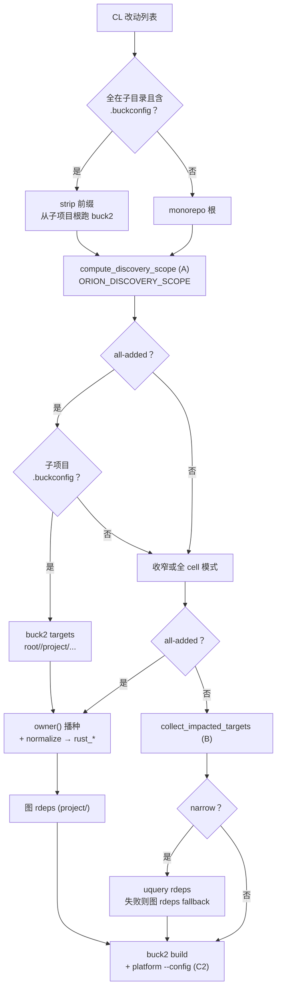

# Target Discovery 扫描范围过大问题分析

本文档记录 Orion worker 在做 Buck2 增量构建时，**target discovery（目标发现）与影响传播范围过大**的问题：一个纯 Rust 改动（如 `rk8s`）曾拉起无关 JVM/Android toolchain，或扫入整个 `third-party/**`，导致构建失败或耗时过长。

涉及代码主要在 `orion` crate（worker 端）。本文作为问题归档、修改方案与**落地进展**说明。

> 重要澄清：`project/buck2_test/toolchains:jdk_system_image`、`__android_sdk_tools__` 等 **不代表 `buck2_test` 业务代码依赖 JVM/Android**。它们只是 JVM/Android toolchain / platform helper target 的**定义位置**恰好在 `project/buck2_test/toolchains` 这个包下。这些 helper 被拉进来，通常是因为默认 platform 为 `prelude//platforms:default`，且影响传播曾不过滤 toolchain/platform 节点——而不是 `rk8s` 真的需要 Java/Android。

---

## 进展摘要（截至 2026-06-23）

| 方案 | 内容 | 状态 | 说明 |
|------|------|------|------|
| **B** | 过滤 toolchain/platform helper 的传播与 build 选集 | **已落地** | `buck_controller.rs`：`is_toolchain_or_platform_*` |
| **C1** | Orion 不再 CLI 强制 `--target-platforms` | **已落地** | platform 由 `.buckconfig` + Orion `--config` 决定 |
| **C2** | 补全 platform 映射 + Orion `--config` 兜底 | **已落地** | `orion/buck/platform.rs`；挂载只读时覆盖不完整 `.buckconfig` |
| **A** | 按改动路径收窄 `buck2 targets` 查询范围 | **已落地** | `orion/buck/discovery_scope.rs`；`ORION_DISCOVERY_SCOPE=0` 可关 |
| **D** | A + rdeps 补齐反向依赖 | **部分落地** | narrow scope 用 `uquery rdeps`；all-added 子项目用**图 rdeps** |
| **子项目根** | 检测 `rk8s/.buckconfig` 等，从子目录跑 buck2 | **已落地** | `detect_subproject_buck_root()` |
| **All-added 子项目** | 全新增 CL 只 build `project/` crate | **已落地** | owner 播种 + `normalize_owner_targets_to_rust` |
| **E** | 收敛 all-added 空 base 的 SelectAll | **已落地** | 任意 all-added CL 跳过图 `SelectAll`，改 `owner()` 播种 |

### CL `UYXIYYNJ`（`rk8s/**` 全量导入）构建对照

| Build | Task ID（前缀） | Discovery | Build 规模 | 结果 |
|-------|----------------|-----------|------------|------|
| #35–#36 | — | 0 target | 跳过 build | 假成功（`finish_without_build` exit 0） |
| #37 | — | 重试 | — | 从 monorepo 根跑 buck2，`set_cfg_constructor` 失败 |
| #39 | `019ef246` | `SelectAll` 全图 | ~39k action | 失败（范围过大） |
| #40 | `019ef252` | `ScopedNew` | ~18k action，真 `rustc` | 失败（FUSE ENOENT） |
| #42 | `019ef325` | owner → **17× `:vendor`** | ~113 action，无 `rustc` | exit 0，**浅层成功** |
| **#45** | `019ef333` | **28× `rust_*`**（owner 归一化 + 图 rdeps） | **23,270 action**；**8,035** local commands；**0%** cache | **exit 0，真编译通过** |

#### Build #45 时间线（`019ef333-db97-70e2-8960-40bcc5cc2496`）

| 阶段 | 时间 (UTC) | 耗时 |
|------|------------|------|
| 收到任务 | 06:38:42 | — |
| CL overlay 就绪 | 06:39:33 | ~51s |
| Discovery 完成（28 targets，子项目 `rk8s/`） | 06:39:56 | ~23s |
| `buck2 build` 开始 | 06:39:56 | — |
| `BUILD SUCCEEDED` | 07:51:54 | **~72 min** |
| 上报 exit 0 | 07:52:00 | 总计 **~73 min** |

日志要点：从 `mount/.../rk8s` 跑 buck2；discovery 后卸载 `old` mount；末尾为 `root//project/rkl:rkl`、`rkforge`、`slayerfs` 等 **`rustc link`**；**无** `uquery rdeps` / `cxx_no_default_deps` 报错（all-added 走图 rdeps）。

---

## 1. 问题现象（历史）

CL（例如 `#UYXIYYNJ`）只新增 `rk8s` 下 Rust 代码与 `third-party/**`，早期构建曾出现：

```
Action failed: root//project/buck2_test/toolchains:jdk_system_image (create_jdk_system_image)
  FileNotFoundError: ... jlink
```

以及 `__android_sdk_tools__` 缺失、`<unspecified>` platform 等。

几个关键事实：

- monorepo 根 `.buckconfig` 下，`rk8s` 与 `project/buck2_test` 同在 **`root` cell**。
- 仅「按 cell 收窄」不够：扫 `root//...` 仍会带入无关 `project/**` 与 `third-party/**`。
- `rk8s` 作为**子项目**有自己的 `.buckconfig`（`root = .`），必须从 `mount/.../rk8s` 跑 buck2，不能从 monorepo 根跑。

---

## 2. 根因分析

worker 端流程：`get_build_targets()` → `collect_impacted_targets()` / owner 回退 → `buck2 build`（见 [buck_controller.rs](../src/buck_controller.rs)）。

### 2.1 发现阶段曾扫全 cell（已由方案 A 缓解）

`get_repo_targets()` 默认通过 `get_all_cell_patterns()` 查询 `root//...`、`toolchains//...` 等。方案 A 根据改动路径收窄为例如 `root//rk8s/...`（见 `compute_discovery_scope()`）。

### 2.2 默认 platform + toolchain 传播（已由 B + C 缓解）

1. 默认 platform `prelude//platforms:default` 会解析多语言 toolchain。
2. 历史上 `recursive_target_changes(..., |_| true)` 不过滤 toolchain/platform。
3. **B**：传播与 build 选集跳过 toolchain/platform helper。
4. **C2**：Orion 对每次 `buck2 targets` / `buck2 build` 注入 `default_target_platforms` 与完整 `target_platform_detector_spec`（含 `buckal//...`），避免 FUSE 只读挂载上旧 `.buckconfig` 导致 `<unspecified>`。

### 2.3 All-added + 空 base 曾 SelectAll（#39）

`base` 图为空时，`EmptyBasePolicy::SelectAll` 会把 diff 图里**所有** target 标为 impacted，包括 `third-party/**` 下每个 crate 的 vendor 根，action 爆炸。

**任意 all-added CL**（含子项目导入与普通「只新增文件」CL）现统一：

1. **跳过** 图 `collect_impacted_targets` + `SelectAll`（避免空 base 全选）。
2. **`owner()` 播种**：改动中的源文件路径（排除 `BUCK`、`Cargo.toml`、`vendor/` 等）。

**All-added 子项目**（改动全在带 `.buckconfig` 的子目录，如 `rk8s/**`）在此基础上还有：

1. **发现范围**：仅 `root//project/...`（不含 `third-party/`）。
2. **`normalize_owner_targets_to_rust`**：buckal 的 `filegroup :vendor` 拥有包内几乎所有文件，`owner()` 常返回 `:vendor`；映射为同 package 的 `rust_library` / `rust_binary` / `rust_test`。
3. **图 rdeps**：在 `project/` 内用 `diff::recursive_target_changes` 扩展反向依赖，**不用** `buck2 uquery rdeps`（遍历 `aardvark-dns` 等会碰到缺失的 `toolchains//:cxx_no_default_deps`）。

### 2.4 owner 误选 `:vendor`（#42）

#42 在 ~30s 内 exit 0，但 buck2 只执行了 17 个 `symlinked_dir vendor`，**无 `rustc`**。根因是 build 列表为 `root//project/*:vendor` 而非 `root//project/*:<crate>`。`normalize_owner_targets_to_rust` 已修复。

### 2.5 0 target 假成功（未修复）

`finish_without_build_if_no_targets()` 在 0 target 时仍返回 exit 0（#35–#36）。与扫描范围无关，但会掩盖发现失败。

---

## 3. 当前 discovery 流程（简图）



---

## 4. 方案说明与状态

### 方案 A：按改动路径收窄发现（**已落地**）

- 落点：`orion/buck/discovery_scope.rs` → `compute_discovery_scope()`。
- 行为：改动在 `rk8s/**` 时查询 `root//rk8s/...`，而非整个 `root//...`。
- 环境变量：`ORION_DISCOVERY_SCOPE=0|false|no|off` 关闭。

### 方案 B：过滤 toolchain / platform helper（**已落地**）

见 `is_toolchain_or_platform_*` 与 `collect_impacted_targets()`；单元测试 `test_toolchain_helper_targets_are_excluded`。

### 方案 C：收敛默认 platform（**C1 + C2 已落地**）

| 子项 | 内容 | 状态 |
|------|------|------|
| **C1** | 移除 Orion CLI `--target-platforms` | 已落地 |
| **C2** | `platform.rs` 注入 `default_target_platforms` + `target_platform_detector_spec` | 已落地 |

仓库根 [.buckconfig](../../.buckconfig) 可与 Orion 注入不一致；**以 Orion `--config` 为准**保证 worker 行为一致。完整裁剪 `prelude//platforms:default`（按语言缩 toolchain）仍未做。

### 方案 D：A + rdeps（**部分落地**）

| 场景 | rdeps 实现 |
|------|------------|
| 普通 narrow scope | `buck2 uquery rdeps(seeds, universe)`；失败时 fallback 图 rdeps |
| all-added 子项目 | 仅用图 rdeps，universe = `root//project/...` |

### 子项目 buck 根（**已落地**）

`detect_subproject_buck_root()`：当所有改动路径在同一含 `.buckconfig` 的目录下（如 `rk8s/`），discovery 与 build 的 `current_dir` 设为 `mount/.../rk8s`，路径去掉 `rk8s/` 前缀。

### 环境变量

| 变量 | 默认 | 作用 |
|------|------|------|
| `ORION_DISCOVERY_SCOPE` | 开启 | `0`/`false`/`no`/`off` 关闭方案 A |
| `ORION_BUCK_REMOTE_CACHE` | 关闭 | `1` 时 buck2 build 允许读 remote cache；否则 `--no-remote-cache` |

---

## 5. 现状小结

| 维度 | 当前行为 | 进展 |
|------|----------|------|
| 发现范围 | 方案 A 按改动子树；all-added 子项目限 `project/` | **已收窄** |
| 子项目 buck 根 | `rk8s/.buckconfig` 等 | **已落地** |
| toolchain 传播 / build 选集 | 过滤 helper | **B 已落地** |
| platform | Orion `--config` + `.buckconfig` | **C2 已落地** |
| all-added 子项目 | owner + rust 映射 + 图 rdeps | **已落地** |
| 0 target | 仍 exit 0 | **待修** |
| FUSE + 真 `rustc` | #45 单点通过（0× ENOENT） | 见 [FUSE_MOUNT_ISSUES.md](./FUSE_MOUNT_ISSUES.md) |

---

## 6. 相关代码索引

| 文件 | 内容 |
|------|------|
| [orion/src/buck_controller.rs](../src/buck_controller.rs) | `get_build_targets()`、B、all-added 子项目、owner 归一化、图 rdeps、`ORION_BUCK_REMOTE_CACHE` |
| [orion/buck/discovery_scope.rs](../buck/discovery_scope.rs) | 方案 A、子项目检测、`ORION_DISCOVERY_SCOPE` |
| [orion/buck/run.rs](../buck/run.rs) | `uquery_rdeps`、`owners` |
| [orion/buck/platform.rs](../buck/platform.rs) | Scheme C2 `--config` |
| [orion/src/repo/diff.rs](../src/repo/diff.rs) | `EmptyBasePolicy`、`recursive_target_changes` |
| [.buckconfig](../../.buckconfig) | 仓库侧 platform（可被 Orion 覆盖） |

---

## 修订历史

| 日期 | 说明 |
|------|------|
| 2026-06-15 | 初稿：根因分析与方案 A–E |
| 2026-06-17 | 补充 B 与 Build #17 验证 |
| 2026-06-18 | 落地 C2 |
| 2026-06-23 | 更新：A/B/C1/D/子项目/all-added 已落地；#39–#42 对照；owner→rust 与图 rdeps |
| 2026-06-23 | **#45** 验证：28 targets、23k action、~73 min、exit 0 真编译 |
