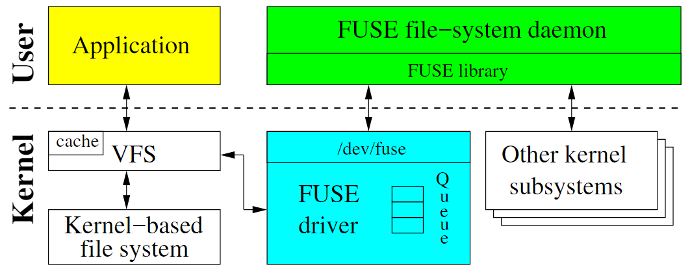

## Scorpio - FUSE Support for Mega/Monorepo Client

### What's the Fuse?

FUSE is the abbreviation for "FileSystem in Userspace".It's an interface for userspace programs to export a filesystem to the linux kernel.
The FUSE project consists of two components: the fuse kernel module (maintained in the regular kernel repositories) and the libfuse userspace library (maintained in this repository).


When VFS receives a file access request from the user process and this file belongs to a certain fuse file system, it will forward the request to a kernel module named "fuse". Then, "fuse" converts the request into the protocol format agreed upon with the daemon and transmits it to the daemon process.

Currently, there have been many successful fuse based projects,

- [s3fs](https://github.com/s3fs-fuse/s3fs-fuse)
 makes you operate files and directories in S3 bucket like a local file system
 
- [sshfs](https://github.com/libfuse/sshfs) 
allows you to mount a remote filesystem using SFTP

- [google-drive-ocamlfuse](https://github.com/astrada/google-drive-ocamlfuse.git) lets you mount your Google Drive on Linux.

### Why the Mega Need a FUSE?

Because the code organization requirements are different from the existing popular distributed version management software Git, clients targeting Monorepo need to implement various additional features to support code pull tasks for large repositories. These requirements include:

1. Partial clone: reduces the time required to obtain a working repository by not immediately downloading all Git objects.

2. Background prefetch: Download Git object data from all remote sources every hour, reducing the time required for front-end Git fetch calls.

3. Sparse checkout: Restrict the size of the working directory.

4. File system monitor: tracks recently modified files, eliminating the need for Git to scan the entire work tree.

5. Submit graph: Accelerate submission traversal and reachability calculations, and speed up commands such as git log.

6. Multi pack index: Implement fast object lookup in many package files.

7. Incremental repackage: Using multiple package indexes, repackage packaged Git data into fewer package files without interrupting parallel commands.

### Some Related

#### [VFS for Git](https://github.com/microsoft/VFSForGit) from Microsoft
VFS For Git is a preliminary attempt by Microsoft on the Monorepo client, which implemented the FUSE system based on Sqlite and Mutli pack index, achieving on-demand partial pull functionality. The client will perceive the user's "open directory" operation before pulling the code content under the corresponding directory.

#### [Sapling](https://sapling-scm.com/) from Meta 
The structure of Sapling is achieved through a multi-layered architecture, with each checkout corresponding to a mount point, followed by an Overlay layer. At the same time, it provides third-party interfaces for other programs to use, so that some heavy IO and computational parts do not need to be consumed by the performance of the virtual layer.


### How to Use?

1. run the mono server in `localhost:8000`.
2. config the `mount_path` and `store_path` in the `config.toml`
3. `cargo run ` in the `scorpio` dictionary.
```bash
Command line arguments for the application

Usage: scorpio [OPTIONS]

Options:
  -c, --config-path <CONFIG_PATH>  Path to the configuration file [default: scorpio.toml]
```

### How to Interact?
The following interfaces are currently available:
```bash
curl -X POST http://localhost:2725/api/fs/mount      -H "Content-Type: application/json"      -d '{"path": "third-party/mega/scorpio"}'
curl -X GET http://localhost:2725/api/fs/mpoint
curl -X POST http://localhost:2725/api/fs/umount      -H "Content-Type: application/json"      -d '{"path": "third-party/mega/scorpio"}'
curl -X POST http://localhost:2725/api/fs/mount      -H "Content-Type: application/json"      -d '{"path": "third-party/mega/ts"}'
```

### How to Configure?
There is a example of `scorpio.toml` in the `scorpio` dictionary.
```toml
base_url = "http://localhost:8000"
lfs_url = "http://localhost:8000"
store_path = "/home/luxian/megadir/store"
workspace = "/home/luxian/megadir/mount"
config_file = "config.toml"
git_author = "MEGA"
git_email = "admin@mega.org"
dicfuse_readable = "true"
load_dir_depth = "3"
```
### `scorpio.toml` Configuration Guide:  

- **`base_url`**  
  Base URL for service APIs (e.g., `http://localhost:8000` for local development).  

- **`lfs_url`**  
  Dedicated URL for Large File Storage (LFS), typically matching `base_url`.  

- **`store_path`**  
  Physical path for storing files (ensure write permissions).  

- **`workspace`**  
  User-visible workspace mount path (i.e., the FUSE filesystem mount point)

- **`config_file`**  
  Extended configuration filename (default: `config.toml`).  

- **`git_author`** / **`git_email`**  
  Default Git author metadata (for version tracking). 

- **`dicfuse_readable`**  
  Allow reading file contents from a read-only directory.

- **`load_dir_depth`**  
  Specifies how deep the file system should load and preload directories during initialization.

### How to Contribute?


### Reference
[1] Rachel Potvin and Josh Levenberg. 2016. Why Google stores billions of lines of code in a single repository. Commun. ACM 59, 7 (July 2016), 78–87. https://doi.org/10.1145/2854146

[2] Nicolas Brousse. 2019. The issue of monorepo and polyrepo in large enterprises. In Companion Proceedings of the 3rd International Conference on the Art, Science, and Engineering of Programming (Programming '19). Association for Computing Machinery, New York, NY, USA, Article 2, 1–4. https://doi.org/10.1145/3328433.3328435

[3] [libfuse](https://github.com/libfuse/libfuse.git) is the reference implementation of the Linux FUSE (Filesystem in Userspace) interface.

[4] [CS135 FUSE Documentation (hmc.edu)](https://www.cs.hmc.edu/~geoff/classes/hmc.cs135.201001/homework/fuse/fuse_doc.html#function-purposes)

[5] [sapling](https://github.com/facebook/sapling.git) : A cross-platform, highly scalable, Git-compatible source control system.

[6] [fuser](https://github.com/cberner/fuser.git) : A Rust library crate for easy implementation of FUSE filesystems in userspace.

[7] [Scalar](https://github.com/microsoft/git/blob/HEAD/contrib/scalar/docs/index.md) : Scalar is a tool that helps Git scale to some of the largest Git repositories. Initially, it was a single standalone git plugin based on Vfs for git, inheriting GVFS. No longer using FUSE. It implements aware partial directory management. Users need to manage and register the required workspace directory on their own. Ease of use can be improved through the fuse mechanism.


# Scorpio RoadMap

## **1. [libufse-fs] overlayFS + passthroughFS**
1. **Performance Optimization**  
   - Enhance performance by leveraging `mmap` and `eBPF`.

2. **Encryption Experimentation**  
   - Explore `rencfs` for file encryption capabilities.

3. **File Layer Management**  
   - Support file layer management for `Docker Build`.


## **2. Git Operation Functionality**
- Support More basic Git operations:  
  - `git log`  
  - `git status`  
  - `git add`  
  - Support `.gitignore` functionality.

## **3. Git LFS Support**
- Integrate Git Large File Storage (LFS) for managing large files.

after mount: 
1. read the .libra_attribute in monorepo , store the patterns in the store path ..
2. get all maybe lfs point(blob);
3. if the file is lfs point, then download it.
before git push .
1. read the  .libra_attribute in the store path ..
2. get all change lfs point(blob);
3. push changed blob to the lfs server;
4. get the lfs point(blob) from the lfs server;
5. build the commit with the lfs point(blob);


## **4. Directory Management**
1. **Local Directory Storage Recovery**  
   - Implement recovery functionality for local directory storage.

2. **Directory Change Monitoring**  
   - Monitor and address inconsistencies between local and remote storage directories.


