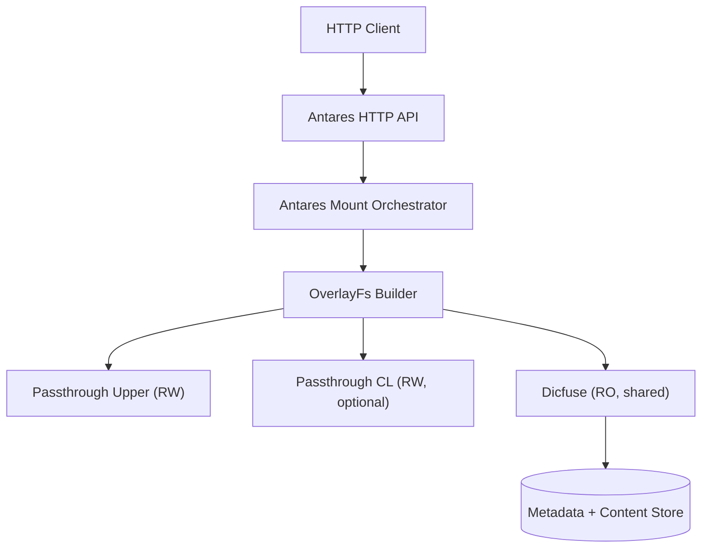

# Antares HTTP API 文档

## 概述

Antares 是一个轻量级的控制平面，按需创建基于 overlay 的 FUSE 挂载。每个 HTTP 请求会构建一个由以下层组成的 overlay 文件系统：
- **Dicfuse** (共享，只读) 位于底层
- **CL passthrough** (可选，每个挂载独立) 位于中间层
- **Upper passthrough** (每个挂载独立，读写) 位于顶层

### 工作流程
1. 客户端调用 Antares HTTP API，指定 monorepo 路径和可选的 CL 标识符
2. 服务器复用全局的 `Arc<Dicfuse>`，自动生成各挂载的目录，并组装层列表
3. `OverlayFs` 被包装在 `LoggingFileSystem` 中，通过 `rfuse3` 在 Tokio 任务中挂载
4. 响应返回 mount ID；后续的 DELETE 请求通过 `fusermount -u` 卸载

### FUSE 层次结构


---

## API 端点

### 1. 健康检查

**端点**: `GET /health`

**描述**: 返回服务健康状态和运行信息。

**响应** (200 OK):
```json
{
  "status": "healthy",
  "mount_count": 3,
  "uptime_secs": 86400
}
```

**字段说明**:
- `status`: 服务健康状态，`"healthy"` 或 `"degraded"`
- `mount_count`: 当前活跃的挂载数量
- `uptime_secs`: 服务运行时间（秒）

---

### 2. 创建挂载

**端点**: `POST /mounts`

**描述**: 创建一个新的 FUSE 挂载。系统会自动基于 UUID 生成所有内部路径。

**请求体**:
```json
{
  "path": "/third-party/mega",
  "cl": "12345"
}
```

**字段说明**:
- `path` (必填): 要挂载的 monorepo 路径
- `cl` (可选): CL (changelist) 标识符，用于创建 CL 层

**路径生成规则**:
所有内部路径基于 UUID 自动生成：
- `mountpoint`: `{antares_mount_root}/{uuid}`
- `upper_dir`: `{antares_upper_root}/{uuid}`
- `cl_dir`: `{antares_cl_root}/{uuid}` (仅在提供 `cl` 时创建)

**响应** (200 OK):
```json
{
  "mount_id": "550e8400-e29b-41d4-a716-446655440000",
  "mountpoint": "/var/lib/antares/mounts/550e8400-e29b-41d4-a716-446655440000"
}
```

**错误响应** (400 Bad Request):
```json
{
  "error": "path cannot be empty",
  "code": "INVALID_REQUEST"
}
```

**错误响应** (400 Bad Request - 重复挂载):
```json
{
  "error": "path /third-party/mega with cl Some(\"12345\") is already mounted",
  "code": "INVALID_REQUEST"
}
```

---

### 3. 列出所有挂载

**端点**: `GET /mounts`

**描述**: 列出所有当前活跃的挂载。

**响应** (200 OK):
```json
{
  "mounts": [
    {
      "mount_id": "550e8400-e29b-41d4-a716-446655440000",
      "path": "/third-party/mega",
      "cl": "12345",
      "mountpoint": "/var/lib/antares/mounts/550e8400-e29b-41d4-a716-446655440000",
      "layers": {
        "upper": "/var/lib/antares/upper/550e8400-e29b-41d4-a716-446655440000",
        "cl": "/var/lib/antares/cl/550e8400-e29b-41d4-a716-446655440000",
        "dicfuse": "shared"
      },
      "state": "Mounted",
      "created_at_epoch_ms": 1702800000000,
      "last_seen_epoch_ms": 1702800123456
    }
  ]
}
```

---

### 4. 查询挂载详情

**端点**: `GET /mounts/{mount_id}`

**描述**: 获取指定挂载的详细信息。

**路径参数**:
- `mount_id`: 挂载的 UUID

**响应** (200 OK):
```json
{
  "mount_id": "550e8400-e29b-41d4-a716-446655440000",
  "path": "/third-party/mega",
  "cl": "12345",
  "mountpoint": "/var/lib/antares/mounts/550e8400-e29b-41d4-a716-446655440000",
  "layers": {
    "upper": "/var/lib/antares/upper/550e8400-e29b-41d4-a716-446655440000",
    "cl": "/var/lib/antares/cl/550e8400-e29b-41d4-a716-446655440000",
    "dicfuse": "shared"
  },
  "state": "Mounted",
  "created_at_epoch_ms": 1702800000000,
  "last_seen_epoch_ms": 1702800123456
}
```

**错误响应** (404 Not Found):
```json
{
  "error": "mount 550e8400-e29b-41d4-a716-446655440000 not found",
  "code": "NOT_FOUND"
}
```

---

### 5. 删除挂载

**端点**: `DELETE /mounts/{mount_id}`

**描述**: 卸载并删除指定的 FUSE 挂载。

**路径参数**:
- `mount_id`: 挂载的 UUID

**响应** (200 OK):
```json
{
  "mount_id": "550e8400-e29b-41d4-a716-446655440000",
  "path": "/third-party/mega",
  "cl": "12345",
  "mountpoint": "/var/lib/antares/mounts/550e8400-e29b-41d4-a716-446655440000",
  "layers": {
    "upper": "/var/lib/antares/upper/550e8400-e29b-41d4-a716-446655440000",
    "cl": "/var/lib/antares/cl/550e8400-e29b-41d4-a716-446655440000",
    "dicfuse": "shared"
  },
  "state": "Unmounted",
  "created_at_epoch_ms": 1702800000000,
  "last_seen_epoch_ms": 1702800234567
}
```

**错误响应** (404 Not Found):
```json
{
  "error": "mount 550e8400-e29b-41d4-a716-446655440000 not found",
  "code": "NOT_FOUND"
}
```

**错误响应** (500 Internal Server Error - 卸载失败):
```json
{
  "mount_id": "550e8400-e29b-41d4-a716-446655440000",
  "state": {
    "Failed": {
      "reason": "unmount failed: Device or resource busy"
    }
  }
}
```

---

## 数据模型

### MountStatus

挂载状态的完整信息：

```rust
{
  "mount_id": "UUID",           // 挂载的唯一标识符
  "path": "String",             // monorepo 路径
  "cl": "Option<String>",       // 可选的 CL 标识符
  "mountpoint": "String",       // 实际的文件系统挂载点
  "layers": {
    "upper": "String",          // 上层目录路径
    "cl": "Option<String>",     // CL 层目录路径（可选）
    "dicfuse": "String"         // Dicfuse 层标识（通常为 "shared"）
  },
  "state": "MountLifecycle",    // 挂载生命周期状态
  "created_at_epoch_ms": u64,   // 创建时间戳（毫秒）
  "last_seen_epoch_ms": u64     // 最后更新时间戳（毫秒）
}
```

### MountLifecycle

挂载生命周期状态枚举：

- `"Provisioning"`: 正在准备中
- `"Mounted"`: 已挂载
- `"Unmounting"`: 正在卸载
- `"Unmounted"`: 已卸载
- `{"Failed": {"reason": "String"}}`: 失败（包含失败原因）

---

## 命令行工具

Antares 还提供命令行工具用于本地管理：

### 启动 HTTP 服务

```bash
antares --config scorpio.toml serve --bind 0.0.0.0:2726
```

### 挂载

```bash
antares mount <job_id> [--cl <cl_name>]
```

### 卸载

```bash
antares umount <job_id>
```

### 列表

```bash
antares list
```

---

## 配置

Antares 从 `scorpio.toml` 配置文件中读取以下配置项：

```toml
[antares]
mount_root = "/var/lib/antares/mounts"
upper_root = "/var/lib/antares/upper"
cl_root = "/var/lib/antares/cl"
state_file = "/var/lib/antares/state.toml"
```

可以通过命令行参数覆盖配置：
- `--mount-root`: 挂载点根目录
- `--upper-root`: 上层根目录
- `--cl-root`: CL 根目录
- `--state-file`: 状态持久化文件

---

## 错误代码

| 错误码 | HTTP 状态码 | 说明 |
|--------|------------|------|
| `INVALID_REQUEST` | 400 | 请求参数无效 |
| `NOT_FOUND` | 404 | 挂载不存在 |
| `FUSE_ERROR` | 500 | FUSE 操作失败 |
| `INTERNAL_ERROR` | 500 | 内部错误 |
| `BAD_PAYLOAD` | 400 | 请求体格式错误 |
| `SHUTDOWN` | 503 | 服务正在关闭 |

---

## 关键特性

### 并发性
- 每个挂载在独立的 Tokio 任务中运行
- Dicfuse 保持共享以避免重复下载数据

### 隔离性
- Upper/CL 目录对每个挂载唯一，写操作不会影响 Dicfuse

### 可观测性
调试时启用日志：
```bash
export RUST_LOG=libfuse_fs::passthrough::newlogfs=debug,rfuse3=trace
```

### 优雅关闭
服务器接收到 SIGINT (Ctrl+C) 信号时，会自动卸载所有挂载并清理资源。

### 清理
- 始终在删除挂载目录前先卸载文件系统，避免内核 I/O 错误
- 卸载失败的挂载会保留在状态中，标记为 `Failed` 状态

---

## 使用示例

### 创建挂载

```bash
curl -X POST http://localhost:2726/mounts \
  -H "Content-Type: application/json" \
  -d '{
    "path": "/third-party/mega",
    "cl": "12345"
  }'
```

### 列出挂载

```bash
curl http://localhost:2726/mounts
```

### 查询挂载

```bash
curl http://localhost:2726/mounts/550e8400-e29b-41d4-a716-446655440000
```

### 删除挂载

```bash
curl -X DELETE http://localhost:2726/mounts/550e8400-e29b-41d4-a716-446655440000
```

### 健康检查

```bash
curl http://localhost:2726/health
```
