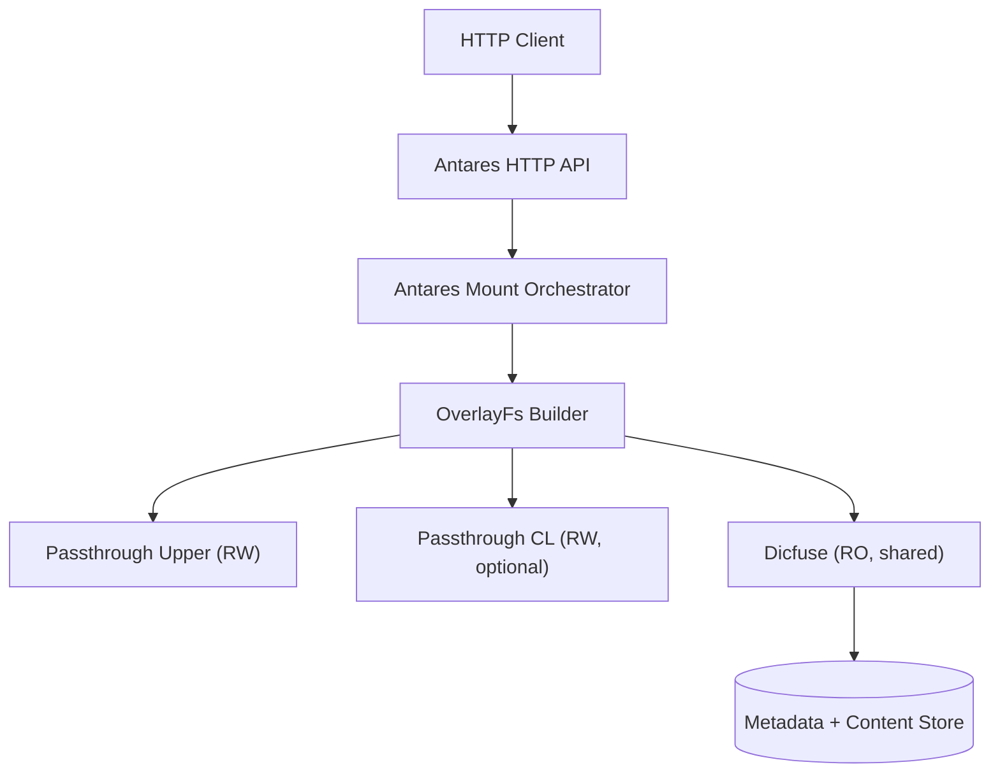

## Antares Module Design

Antares is a lightweight control plane that creates overlay-based FUSE mounts on demand. Each HTTP request provisions one overlay filesystem composed of:
- **Dicfuse** (shared, read-only) at the bottom.
- **CL passthrough** (optional, per mount) in the middle.
- **Upper passthrough** (per mount, read-write) on top.

### Workflow Snapshot
1. Client calls the Antares HTTP API with mountpoint and layer directories (upper, optional CL).
2. Server reuses a global `Arc<Dicfuse>`, prepares per-mount directories, and assembles the layer list.
3. `OverlayFs` is wrapped in `LoggingFileSystem` and mounted via `rfuse3` inside a Tokio task.
4. Responses return the mount ID; future DELETE requests tear it down via `fusermount -u`.

### FUSE Stack

### Key Considerations
- **Concurrency**: Each mount runs in its own Tokio task; Dicfuse stays shared to avoid repeated downloads.
- **Isolation**: Upper/CL directories are unique per mount, so writes never touch Dicfuse.
- **Observability**: Enable `RUST_LOG=libfuse_fs::passthrough::newlogfs=debug,rfuse3=trace` when debugging kernel/syscall errors.
- **Cleanup**: Always unmount before deleting the per-mount directories to avoid kernel I/O errors.

This concise outline plus the figure should be enough context to discuss or extend the Antares module.
