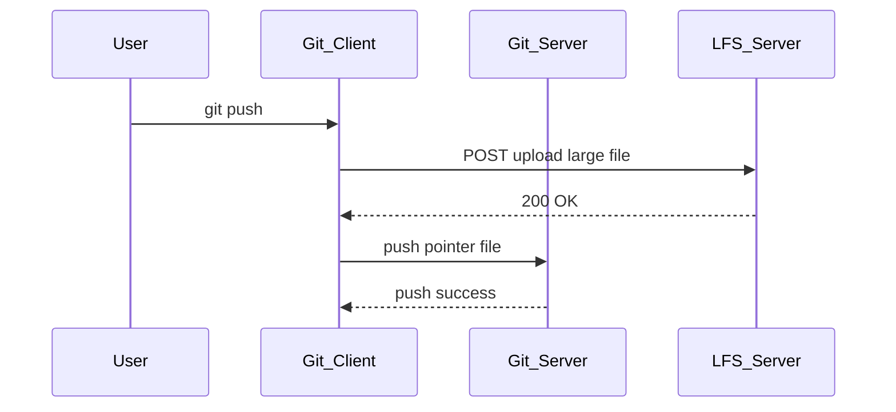

# Scorpio LFS Proposal
This is a proposal for a new feature in the Scorpio project. The proposal is to add support for large file storage (LFS) in the project.
## Introduction
Large File Storage (LFS) is essential for managing large files efficiently in version control systems. This proposal outlines the benefits and implementation strategy for integrating LFS into the Scorpio project.

## Benefits
- Improved performance for repositories with large files.
- Reduced clone and fetch times.
- Better handling of binary files with FUSE interface.

## Differentiation from Git LFS

git/libra uses local storage (such as files or small databases) to save information related to git objects. However, Scorpio does not store this information and only provides the complete file contents during a single version update.

## Implementation Strategy
By leveraging the libra-LFSClient module, a set of RESTful HTTP interfaces were redesigned to mimic the functionality of their command-line counterparts. The following key tasks were addressed:
1. Managing `.libra_attributes` Files: This section primarily reuses existing code with minimal modifications, focusing on defining the specific save path for these files.
2. Restoring Files via `lfs-checkout`: To optimize the restore process, the directory scope is restricted. The initial design includes all mount nodes while allowing manual specification of a parent directory for pull operations. To track the activation status of the LFS path, a dedicated mechanism is implemented and stored in `config.toml`. Pulled large files are saved either in the lower layer of the mounted inode (using `overlayfs`) or in a separate directory designated as the `read-only layer`.
3. Handling LFS File Pointers: A `KV-DB` is utilized to store the initial LFS file pointer information retrieved during the pull operation.
4. Pushing Changes Back: Leveraging overlayfs, modified large files are quickly identified, and new file pointers are generated for them.
5. Support for LFS Lock/Unlock: The system incorporates functionality to handle LFS locking and unlocking operations seamlessly.

